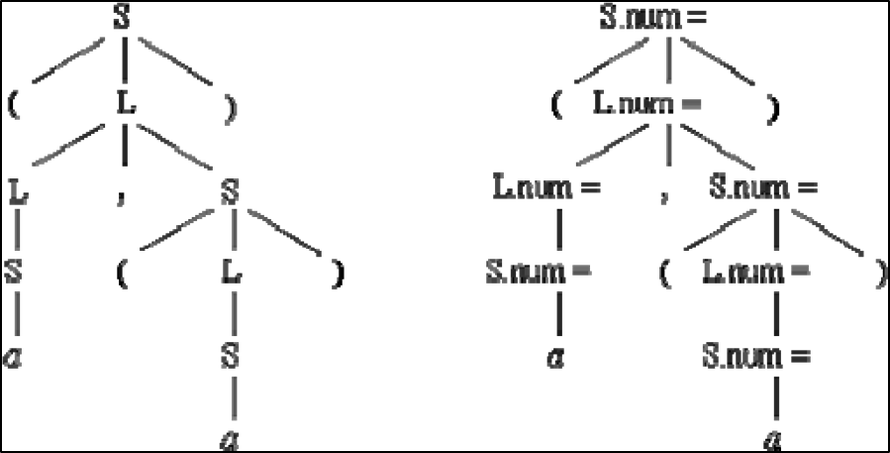
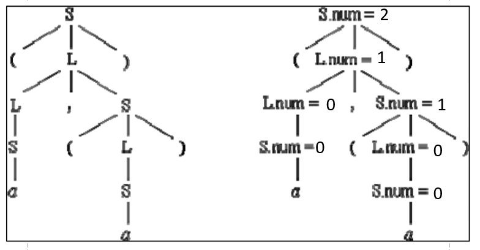
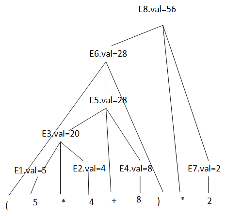

给定文法G[S]: 

```
S →（L）| a 
L → L , S| S 
```

如下是相应于G[S]的一个属性文法：

```
S →（L）    { S.num := L.num +1; }
S →a      { S.num := 0; } 
L → L1 , S     { L.num := L1.num + S.num; } 
L → S      { L.num := S.num; } 
```

下图分别是输入串 ( a，( a ) ) 的语法分析树和对应的带标注语法树，但其属性值没有标出，试将其标出（即填写右下图中符号 “=” 右边的值）。



答案：



采用语法制导翻译思想，表达式E 的“值”的描述如下：

```
产生式       语义动作
S′→E       {print E.VAL} 
E→E1+E2    {E.VAL∶=E1.VAL+E2.VAL} 
E→E1*E2    {E.VAL∶=E1.VAL*E2.VAL} 
E→(E1)     {E.VAL∶=E1.VAL} 
E→n        {E.VAL∶=n.LEXVAL} 
```

如采用LR 分析方法，给出表达式(5\*4+8)\*2 的语法树并在各结点注明语义值VAL。

分析的每一步结果如下：

1.  (
2.  (5
3.  (E1
4.  (E1\*
5.  (E1\*4
6.  (E1\*E2
7.  (E3
8.  (E3+
9.  (E3+8
10.  (E3+E4
11.  (E5
12.  (E5)
13.  E6
14.  E6\*
15.  E6\*2
16.  E6\*E7
17.  E8
18.  S\'




有循环语句：while （A＜B） do if （C＜D） then X=Y+Z，请翻译成四元式或TAC形式的中间代码

四元式，假设从100号地址开始

```
100	J<,A,B,102
101	JMP,_,_,106
102	J<,C,D,104
103	JMP,_,_,105
104	+,Y,Z,X
105	JMP,_,_,100
106	
```


