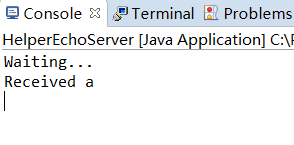

# Java UDP 编程简介

## 涉及到的类

1.  java.net.DatagramPacket
2.  java.net.DatagramSocket

## UDP协议头

IP包已经包含了源地址和目的地址。UDP数据报由可选的源端口、必须的目的端口、数据报含头的总长度、校验和以及数据。

```
                  0      7 8     15 16    23 24    31
                 +--------+--------+--------+--------+
                 |     Source      |   Destination   |
                 |      Port       |      Port       |
                 +--------+--------+--------+--------+
                 |                 |                 |
                 |     Length      |    Checksum     |
                 +--------+--------+--------+--------+
                 |
                 |          data octets ...
                 +---------------- ...
```

在java编程中，其中的源端口由DatagramSocket控制，目的端口由DatagramPacket控制，不过都存储在DatagramPacket对象当中。

## 客户端发送用户数据报（UDP Packet）的流程

1.  准备一个字节数组作为数据报的数据
2.  创建DatagramPacket对象，设置其目的地址和目的端口，不必管本地端口，本地端口由DatagramSocket自动选择空闲端口
3.  创建DatagramSocket对象，**不必**设置端口等信息
4.  用DatagramSocket对象发送DatagramPacket对象

客户端代码

```java
import java.io.Closeable;
import java.io.IOException;
import java.net.DatagramPacket;
import java.net.DatagramSocket;
import java.net.InetSocketAddress;
import static com.idealisan.udp.stream.DevTool.*;

public class BaseUDPCable implements Closeable {
	public static final byte TEST_BYTE = 'a';
	private DatagramSocket datagramSocket;

	public BaseUDPCable(String remoteHost, int port) throws IOException {
        //使用一个仅含‘a’的字节数组作为数据创建用户数据报
		DatagramPacket datagramPacket = new DatagramPacket(new byte[] { TEST_BYTE }, 0, 1,
				new InetSocketAddress(remoteHost, port));
        //创建套接字
		datagramSocket = new DatagramSocket();
        //发送数据报
		datagramSocket.send(datagramPacket);
		if(DEBUG) {
			datagramSocket.receive(datagramPacket);
			System.out.println(new String(datagramPacket.getData()));
		}
	}

	@Override
	public void close() throws IOException {
		datagramSocket.close();
	}
	
	public static void main(String[] args) {
		try {
			new BaseUDPCable("localhost", HelperEchoServer.TEST_PORT).close();
			
		} catch (IOException e) {
			// TODO Auto-generated catch block
			e.printStackTrace();
		}
	}

}
```

## 服务器端

1.  创建DatagramSocket，指定要监听的端口
2.  创建空白数据报对象
3.  接受数据报到准备好的空白数据包对象里
4.  从数据报里取数据、发送方主机的地址和发送端口

注意，由于本机地址不会在接收到的数据包中，所以无法从数据报对象的getAddress()方法中获得IP地址。getSocketAddress()方法会判断是否是本地地址，如果是则会给一个代表本地地址的IP。所以在测试的时候应使用后一个方法获得地址。

```java
import java.io.IOException;
import java.net.DatagramPacket;
import java.net.DatagramSocket;
import java.net.SocketException;

public class HelperEchoServer implements Runnable {

	public static final int TEST_PORT = 3695;
	public static final int TEST_PACKET_SIZE = 2048;

	public static void main(String[] args) {
		new HelperEchoServer().run();
	}

	@Override
	public void run() {
		DatagramSocket datagramSocket = null;
		try {
            //创建一个监听特定端口的套接字
			datagramSocket= new DatagramSocket(TEST_PORT);
		} catch (SocketException e1) {
			// TODO Auto-generated catch block
			e1.printStackTrace();
			System.exit(0);
		}
        //创建一个空白数据报
		DatagramPacket p=new DatagramPacket(new byte[TEST_PACKET_SIZE],TEST_PACKET_SIZE);
		System.out.println("Waiting...");
		while (true) {
			try {
                //接受信息并写软双开数据报对象里
				datagramSocket.receive(p);				
                //取出数据
				System.out.print("Received "+new String(p.getData()));	
                //取出数据报的远程地址，远程地址是SocketAddress，不是Address
                System.out.println(p.getSocketAddress());
			} catch (IOException e) {
				// TODO Auto-generated catch block
				e.printStackTrace();
			}catch (Exception e) {
				e.printStackTrace();
				break;
			}

		}
		datagramSocket.close();

	}

}

```

服务器端显示

