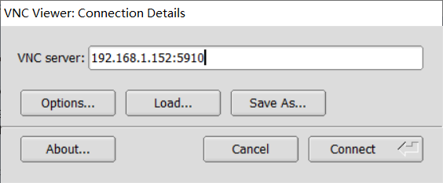
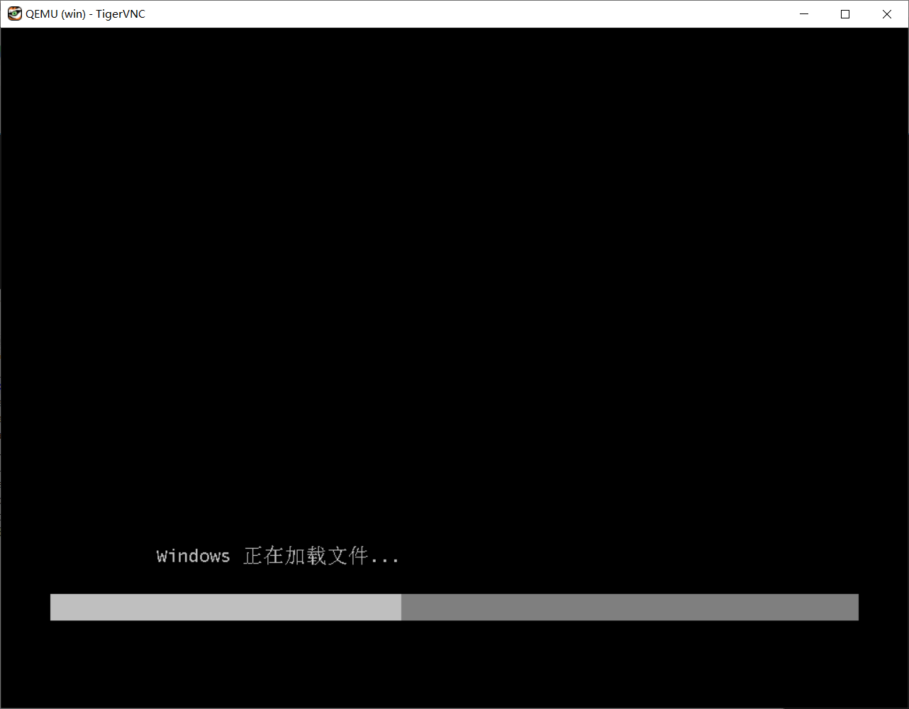
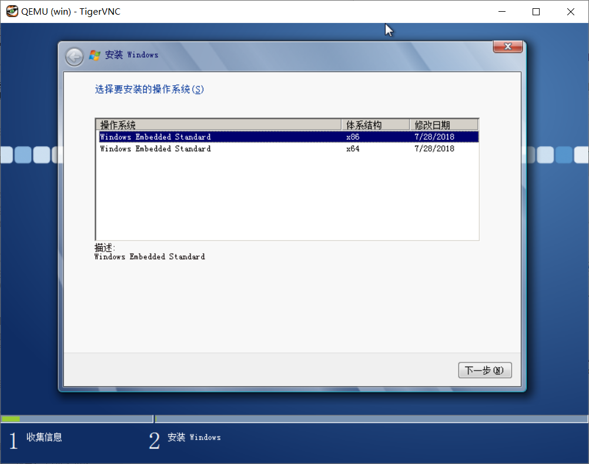
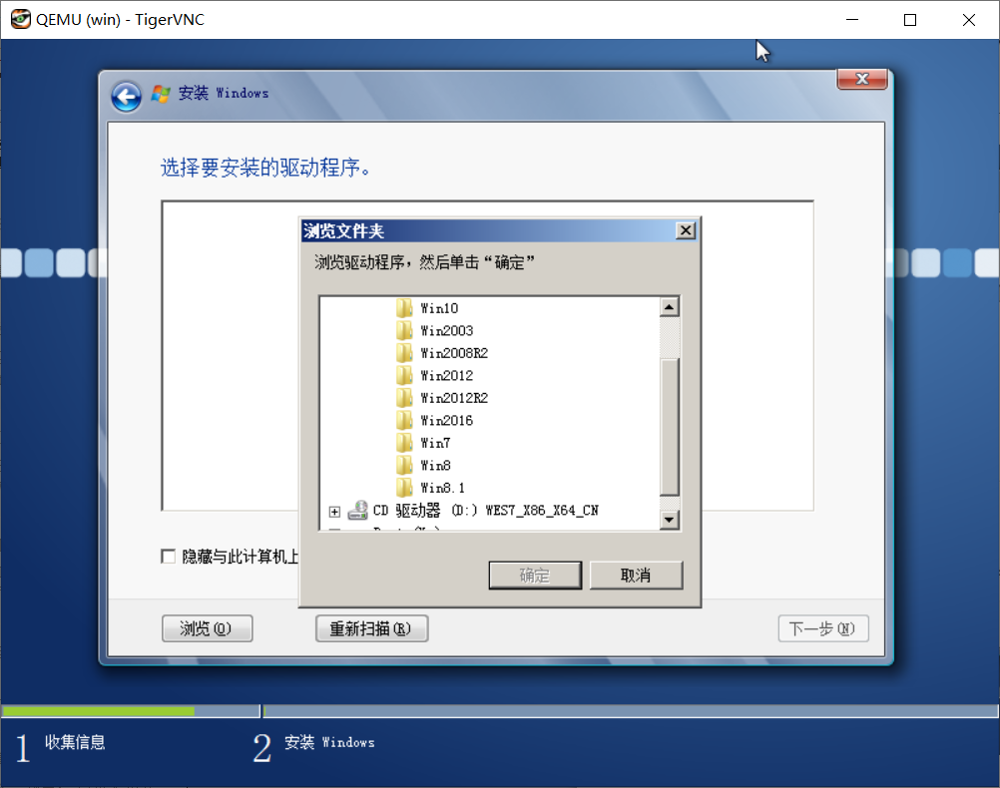
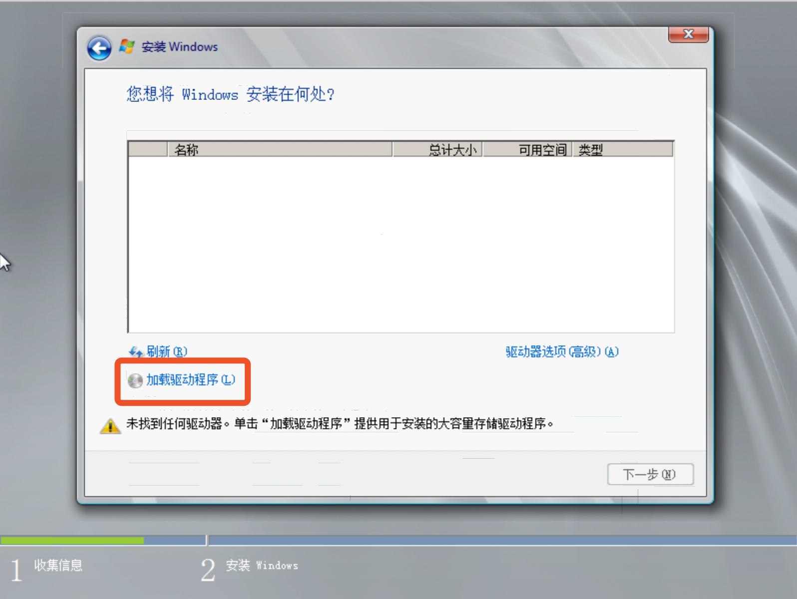

## 检查机器是否具有硬件虚拟化功能

使用以下命令再linux中检查当前机器是否开启了硬件虚拟化。

```shell
$ egrep -c '(svm|vmx)' /proc/cpuinfo
2
```

以上命令其实是计数了cpu信息里的svm或者vmx字符串出现的次数，只要出现了其中任意一个那就意味着机器具有硬件虚拟化功能且已经开启。我的机器显示2，意味着出现了两次这种字符串，已开启了硬件虚拟化。

其实绝大多数机器都有硬件虚拟化功能，以下情况可能没有硬件虚拟化所以无法开启KVM。

1.  CPU无硬件虚拟化功能
2.  主板固件设置里没开启硬件虚拟化功能
3.  当前使用的就是虚拟机，例如VPS，且虚拟机配置里没开启硬件虚拟化特性。虚拟机里嵌套虚拟机实在不是什么好主意，不要费力气尝试。

其中第二点可以尝试在主板设置，即BIOS或者UEFI中开启虚拟化。

## 安装KVM组件

要使用KVM，需要安装一些管理工具和虚拟机软件。使用如此我的命令安装这些管理工具和软件。

```shell
$ sudo apt-get install -y --no-install-recommends qemu-kvm qemu-utils libvirt-bin virtinst cpu-checker
```

其中没有安装用于在linux上查看KVM虚拟机的客户端软件。服务器都是命令行，没有安装 X 桌面（弱鸡VNC桌面里再嵌套一个VNC实在听起来不是什么好主意），所以加入 `--no-install-recommends` 参数，否则会安装 `virt-viewer` 之类的包，在它们的依赖关系中有 X11 和很多图形图像库，而这些都用不上。如果开启了桌面系统，那么可以不加该参数。

安装完成后可以使用如下命令测试，如下的输出说明已经安装完毕。

```shell
$ kvm-ok
INFO: /dev/kvm exists
KVM acceleration can be used
```

安装成功后记得将KVM所使用的服务启动并设置开机启动。

将libvirtd添加自启动：

```shell
sudo systemctl start libvirtd.service
sudo systemctl enable libvirtd.service
```

## 配置桥接网卡

ubuntu 18不再使用ifupdown，而是用netplan，所以要使用yaml语法编写/etc/netplan/下的配置文件。来自于netplan官网netplan.io的设置桥接网卡的例子：

基本的桥接网卡：

```yaml
network:
  version: 2
  renderer: networkd
  ethernets:
    enp3s0:
      dhcp4: no
  bridges:
    br0:
      dhcp4: yes
      interfaces:
        - enp3s0
```

使用libvirtd的桥接网卡配置：

```yaml
network:
  version: 2
  renderer: networkd
  ethernets:
    enp0s25:
      dhcp4: true
  bridges:
    br0:
      addresses: [ 10.3.99.25/24 ]
      interfaces: [ vlan15 ]
  vlans:
    vlan15:
      accept-ra: no
      id: 15
      link: enp0s25
```

根据LITE的实际网络环境，实际配置如下：

```yaml
network:
  version: 2
  renderer: networkd
  ethernets:
    enp3s0:
      dhcp4: no
  bridges:
    br0:
      dhcp4: yes
      interfaces:
        - enp3s0
```

*设置失败或错误的情况下，出现了不想要的桥接网卡或者VLAN，重启之后就会消失，这是因为重启后网络配置会根据配置文件从空白开始建立。*

如果使用ifupdown，可以参考如下未经测试的配置，将其添加到`/etc/network/interfaces`：

```yaml
 auto br0
# 网桥使用DHCP模式，从DHCP服务器获取IP
iface br0 inet dhcp
# 主网卡名称，网桥创建前连接外部的网卡
bridge_ports enp3s0
# 避免数据链路出现死循环
bridge_stp on
# 将转发延迟设置为0
bridge_fd 0
```

修改配置后需要重新启动网络服务。使用netplan和ifupdown需要不同的方式来启用新的配置。

*注意，应用新的网络配置将会导致网络短暂中断，如果配置有误则无法使用网络，因此应当保证可以直接操作机器而不仅仅是使用SSH或者其他工具远程操作。*

使用netplan时，直接使用netplan命令即可应用新的配置：

```shell
$ netplan apply
```

如果配置文件不包含参数字段`parameters`则可以使用如下命令测试配置而不直接应用：

```shell
$ netplan try
```

测试配置将不会直接应用，在上面的命令之后如果120秒之内没有回车确认，比如因为网络错误导致断开远程连接而无法确认，那么将会自动恢复原来的网络配置。测试模式要求配置不包含参数字段等复杂配置，否则不能测试，只能人眼仔细检查然后直接应用。

使用ifupdown时参考如下命令重启网络配置：

```shell
$ sudo systemctl restart networking.service
```

然而实际使用中ubuntu server 18.04 LTS 没有上边的服务，经过使用`systemctl list-units | grep network`可以看到使用的network服务其实叫做`systemd-networkd.service`，命令换成：

```shell
$ sudo systemctl restart systemd-networkd.service
```

修改防火墙配置。休要将ufw防火墙配置中的转发开启，或者干脆关掉防火墙。ufw关于转发的配置文件位于`/etc/default/ufw`，将其中的转发字段改为`DEFAULT_FORWARD_POLICY="ACCEPT"`。

其实在后续使用VNC连接KVM里的Windows的时候还是关了ufw才连上。

## 安装客户机系统

首先确定安装命令里的配置，我们需要根据安装的配置创建一些目录和文件。

将如下命令保存为脚本或者直接在bash命令行里执行。

```shell
#！/bin/bash
sudo virt-install -n win7 \
--description "win7" \
--os-type=win --os-variant=win7 \
--ram=1024 --vcpus=1 \
--disk path=/home/myname/kvm/data/win7/win7.qcow2,bus=virtio,size=40 \
--disk path=/home/myname/kvm/iso/virtio-win-0.1.160_amd64.vfd,device=floppy \
--network bridge:br0,model=virtio \
--accelerate \
--graphics vnc,password=myvncpsw,listen=::,port=5910\
--cdrom=/home/myname/kvm/iso/windows_install.iso
```

1.  其中的内存和CPU根据自己机器配置决定
2.  virtio-win-0.1.160_amd64.vfd是虚拟机的存储器驱动，需要在安装的时候使用。其实更好的办法是提前把驱动添加到Windows的安装镜像里。驱动可以在`https://fedorapeople.org/groups/virt/virtio-win/direct-downloads/archive-virtio/` 找到。如果要提前添加到Windows的镜像里，建议直接下载iso的包而不是vfd，因为Windows上没有方便地工具可以解压或者挂载这种虚拟软盘。
3.  记住vnc配置的端口和密码，安装和以后使用会用到，建议将命令保存为脚本使用。其实以后使用Windows可以用远程桌面连接，但安装的时候除非花功夫做自动应答，否则还是要用VNC。

安装前要先为虚拟机创建好虚拟磁盘，在配置里的/home/myname里创建各级目录，并在data目录里使用如下命令创建虚拟磁盘。

```shell
$ qemu-img create -f qcow2 win7.qcow2 40G
```

在启动安装前还要修改qemu的配置文件使其接受以特定的用户的身份运行。修改的文件位于`/etc/libvirt/qemu.conf`。使用vi的查找功能快速找到`user="root”`和`group="root”`，将这两行取消注释。随后将使用sudo命令以管理员权限运行安装命令。

接下来就可以使用上边的命令开启安装虚拟机了。

```shell
sudo ./install_win_kvm.sh
```

建议使用screen开启一个避免断线的终端，在其中运行安装命令，因为安装命令是阻塞的，且一直阻塞。使用screen一方面避免断线导致安装过程被迫中断，另一方面避免终端被阻塞而无法做其他操作。

## 使用Dism++为Windows安装镜像添加驱动

将安装镜像里的boot.wim和install.wim提取出来，注意检查其文件属性可能是只读的，需要取消只读属性。

使用Dism++挂载这两个文件到两个文件夹里，注意选择boot.wim的可启动的那个镜像版本，选择install.wim的x64版本。

挂载完成后，分别在两个镜像里选择管理驱动/添加驱动。使用Windows10自带的功能或者第三方软件比如软媒虚拟光驱工具或者好压iso挂在工具把下载的virtio的iso镜像挂载到资源管理器里，使用Dism++从驱动包里选择viostor下的对应版本的驱动，添加进去。

记得添加完驱动先别卸载镜像，需要保存镜像之后才能卸载镜像或者另存为镜像。保存镜像的时候选择增量保存即可，驱动程序很小，不会带来太多的额外空间开销。

## 在VNC Viewer里安装Windows

使用VNC Viewer，任意一款均可。我使用的是Tiger VNC Viewer。在连接窗口中输入IP地址和端口，然后点击右下角的connect连接。然后会要求输入密码，密码就是安装命令里的vnc密码，上边的命令里是`myvncpsw`。



*如果VNC Viewer无法连接，请检查linux宿主机的防火墙，在此处我将防火墙关闭了。*

接下来会看到一个窗口里有着Windows启动画面（如果没错过的话）和安装的窗口，按照一般的安装过程安装即可。





如果没有向Windows安装镜像提前添加驱动，那么需要在安装时选择浏览驱动程序，但是并不能保证添加成功。






Windows不允许加载未签名的64位驱动程序，那么仅仅可以安装32位Windows，或者选择提前添加驱动。

安装过程虚拟机会有几次重启，过程会使VNC断线，所以要重新连接VNC观察安装进度和完成安装过程的交互。

## KVM管理常用命令

安装电源管理包才能支持电源操作：

```shell
 $ sudo apt install -y acpid acpid-sysvinit
 $ sudo service acpid start
```

1.  开机：virsh start win7
2.  关机：virsh shutdown win7
3.  重启：virsh reboot win7
4.  查看所有虚拟机：virsh lista --all
5.  查看活动的虚拟机列表：virsh list
6.  设置win7虚拟机开机自动启动：virsh autostart win7
7.  取消win7虚拟机开机自动启动：virsh autostart --disable win7
8.  虚拟机配置文件位于/etc/libvirt/qemu/目录下
9.  修改虚拟机配置文件的建议方法：virsh edit win7
10.  备份虚拟机配置使用virsh而不是复制：virsh dumpxml win7 >/home/kvmback/win7_back.xml
11.  强行停机：virsh destroy
12.  删除虚拟机（必须先停机）：virsh undefine my_VM_Name
13.  暂停虚拟机：virsh suspend win7
14.  快速休眠：virsh dompmsuspend win7
15.  查看xml格式的虚拟机配置：virsh dumpxml win7  
16.  从睡眠中恢复：virsh dompmwakeup  win7