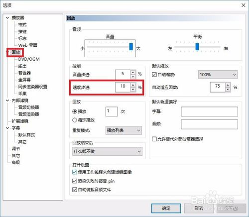
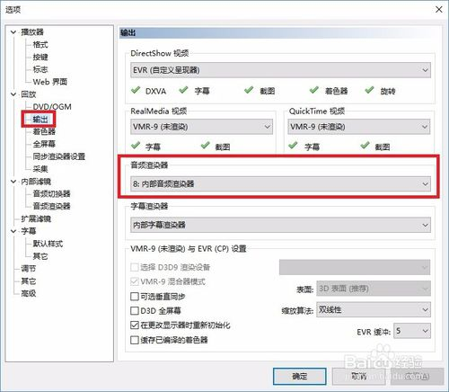

# MPC-HC 通过设置实现任意倍速播放

打开MPC-HC，鼠标右键，打开“选项”，找到“回放”选项卡，将“速度步进”的数值改为10（或其他，此数值表示播放速度的最小改变量）。

点击确定，保存所作修改。

重启MPC-HC，使用快捷键“Ctrl+Up”即可实现倍速播放。以“速度步进”10%为例，使用一次快捷键，播放速度便增加10%。

## 注意事项

更改设置后必须重启播放器。

## 实现倍速播放不改变音调

打开MPC-HC，鼠标右键，打开“选项”，找到“回放”-“输出”选项卡，将将“音频渲染器”更改为“内部音频渲染器”。

点击确定，保存所作修改。

重启MPC-HC，点击“播放”—“增加速率”或使用快捷键“Ctrl+Up”即可实现倍速播放体验效果。