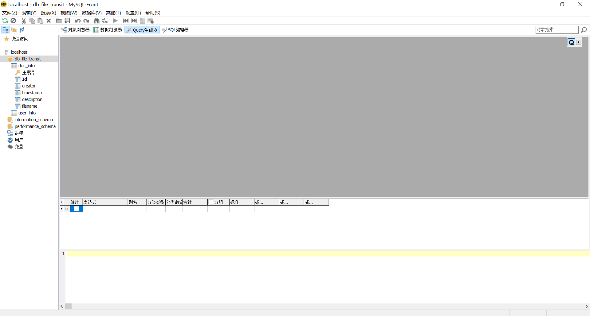
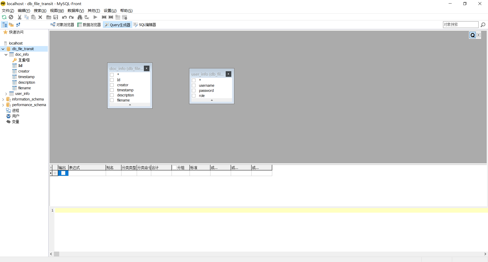
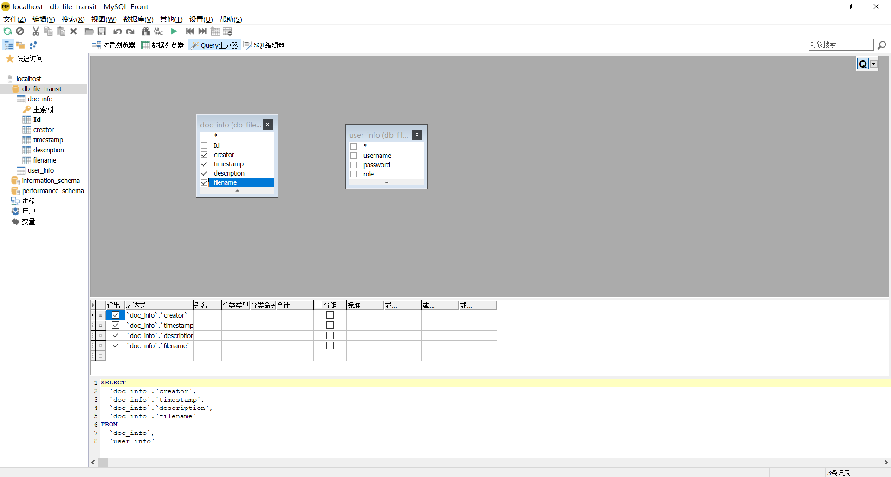
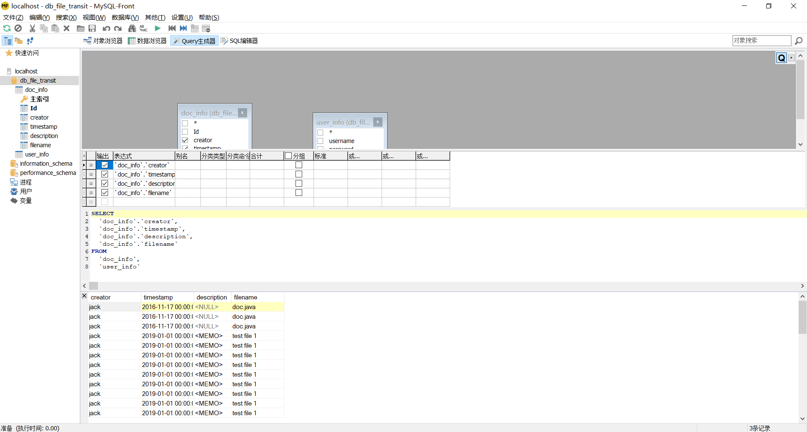
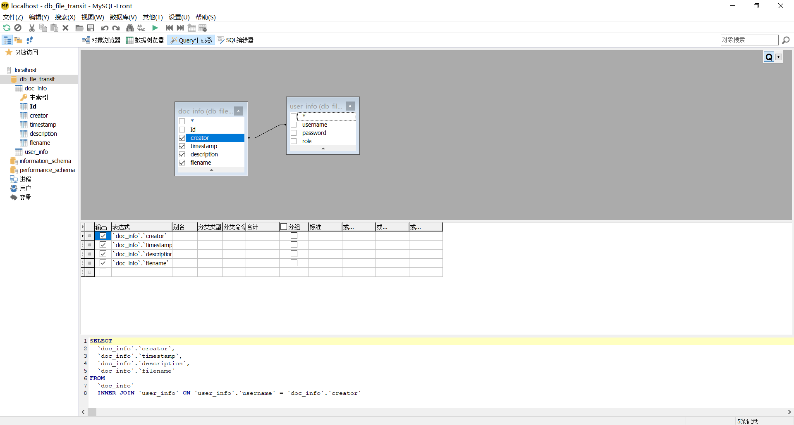
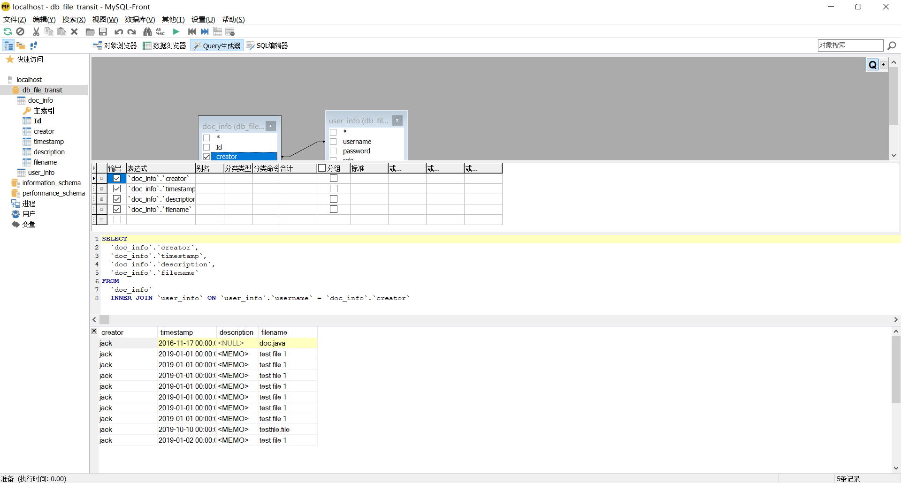
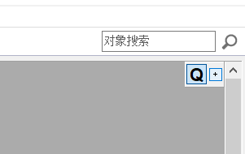
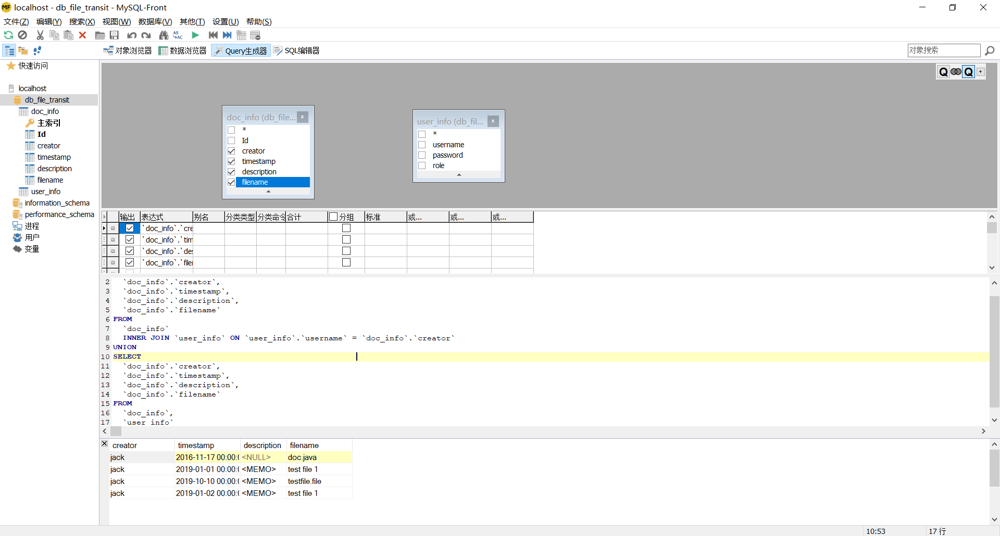
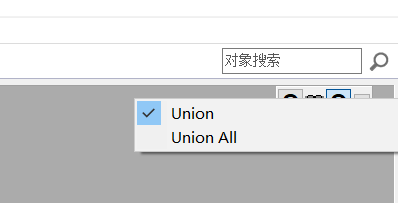

# 使用Query生成器快速生成无错、格式化的SQL查询语句

在MySQL-Front中使用Query生成器，需要先点击工具栏中的Query生成器按钮，进入相应的空白界面。

接下来使用拖拽的方法把数据表从左边的列表中拖拽到右边的灰色区域。

此时，勾选灰色区域里表格每一行前边的方框，就代表你想要让这个属性出现在最终的查询结果里。

随着勾选，下方也会即时生成SQL语句和一个表格。此时点击工具栏上绿色的三角按钮，就执行了所生成的SQL语句。可以看到执行结果列出了所有文件的创建者、时间戳、描述和文件名。

点击结果栏左上角的小叉，暂时关闭结果栏。回到灰色区域，按住creator并拖动到用户信息表的用户名属性上，将这两个用线连了起来。这意味着文件信息表中创建者要出现在用户信息表中的用户名字段上，如果文件的创建者没有出现在用户信息表的用户名里，那么不会出现在结果中。主要讲生成的SQL语句。

其实文件表里的文件的创建者必然是一个用户，所以结果和前一次没区别。

灰色区域的右上角，一个大写的Q代表一个独立的Query，右侧一个加号，点击它可以添加一个Query并自动和前一个Query联合起来。

联合子查询意味着可以把多个查询的结果合并在一起展示。这要求多个查询的结果都是相同的列，也就是列的数量和列的名称完全一样，这样才能把两个查询的结果放在一起，形成一个可能更短的合并重复项后的结果列表。

此时我们在新的子查询中选择文件信息表的那四个属性，和前边选择的要一样。

如果想要不合并重复项，而是得到一个可能更长的结果列表，则右键点击灰色区域右上角的相交的深灰色的两个圆圈，选择Unoin All。

中间还有一个可以设置别名、分组等操作的区域，这里先不涉及。