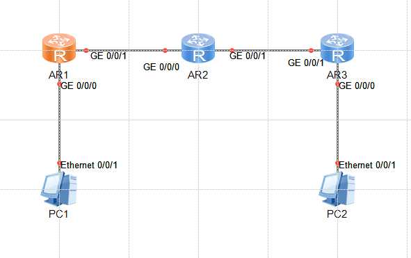

## 实验设备连接

采用的设备有三台AR2240路由器和三台PC机。链接如下图：



##### PC1的IP配置如下：

IP地址：192.168.100.1

子网掩码：255.255.255.0

默认网关：192.168.100.99

*注意，华为设备不允许使用x.x.x.0的IP*

##### PC2的IP配置如下：

IP地址：192.168.200.1

子网掩码：255.255.255.0

默认网关：192.168.200.99

*注意，华为设备不允许使用x.x.x.0的IP*

##### 配置路由器用到的命令

为路由器添加端口的IP地址命令如下：

```
int g0/0/0
ip address 10.0.20.99 24
quit
int g0/0/1
ip address 10.0.12.2 24
quit
```

开启RIP协议的命令如下：

```
sys
rip 1
version 2
network 一个端口的ip地址
network 另一个端口的ip地址
```

##### AR1设置如下：

g0/0/0端口IP：192.168.100.99

g0/0/1端口IP：192.168.101.1

##### AR2设置如下：

g0/0/0端口IP：192.168.101.2

g0/0/1端口IP：192.168.102.1

##### AR3设置如下：

g0/0/0端口IP：192.168.200.99

g0/0/1端口IP：192.168.102.2

## 遇到的问题

RIP协议按照A、B、C三类网络地址来配置，只接受合法的这三类地址的网络好，比如实验中使用的10.0.10.1这个地址，对应的是A类的网络号10.0.0.0。

实验中路由器两端都用的是10.0.0.0段的网络地址，所以都是相同的主网络号。

## 实体机实验结果

按照类似模拟器实验的方法配置PC的IP和路由器的哥哥端口的IP，


