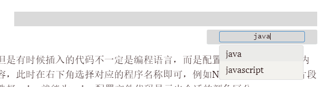
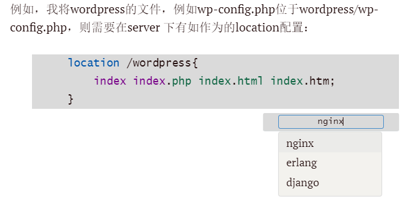

## Typora可以为代码段落选择语言格式高亮

在Typora里边插入段落代码的时候，可以在右下角选择代码格式，从而提供有颜色的代码显示效果。

## 还可以选择程序文档格式而不仅是编程语言

但是有时候插入的代码不一定是编程语言，而是配置文件或者其他文件内容，此时在右下角选择对应的程序名称即可，例如Nginx配置文件代码片段选择nginx就能为nginx配置文件代码显示出合适的颜色区分：

