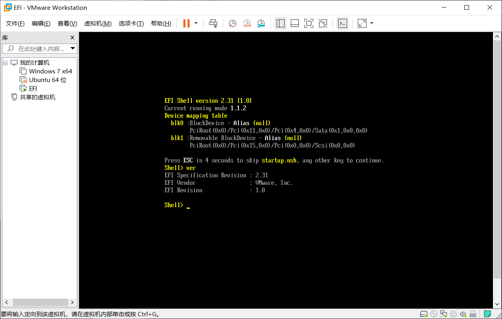
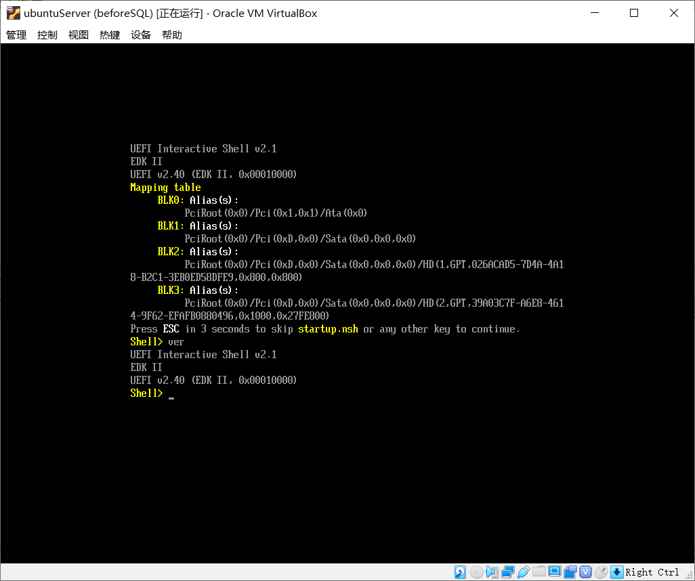
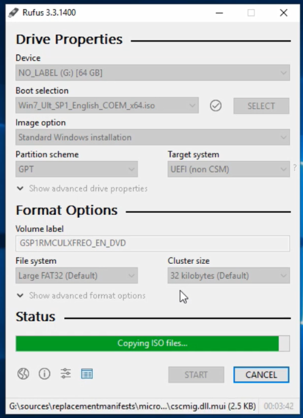

# 在UEFI固件中安装Windows7所需要处理的步骤

## 预知：

EFI模式下Windows7要求使用GPT磁盘，而电脑磁盘可能已经是MBR模式的，注意可能因为MBR模式的磁盘而无法安装。

安装时不要使用传统模式安装，但要考虑关闭安全启动。

Windows7仍然要求使用某些老旧的固件调用，所以新版本的EFI固件中可能关闭、移出了这些调用导致无法安装，需要开启兼容模式来提供这些调用。例如VirtualBox使用2.1版本的UEFI，无法安装Windows7。而Vmware可能默认开启了兼容模式，无需额外设置就能在使用UEFI固件的模式下安装Windows7。在实体机上，则需要观察机器实际搭载的UEFI版本和设置。

可以看到，Vmware使用的是2.3版本的设计，但是实际上回退到了1.0版本。经过测试，如果在虚拟机的设置/选项/高级里边开启UEFI固件的安全引导功能，那么将无法进入EFI Shell，无法查看UEFI固件的版本信息。

在VirtualBox中，使用的是2.1版本的接口，而固件版本则是2.4。

## 工具软件

需要使用的工具软件：

1.  Rufus
2.  UltraISO

以上两个任选其一作为将ISO镜像文件挂载或者写入U盘的工具。

还需要使用工具软件来提取.wim文件里的内容：

1.  Bandizip
2.  7zip
3.  Dism++

以上工具任选其一，用来解压或者挂载.wim文件，从而提取其中的个别文件。推荐使用解压软件而不是挂载软件Dism++等，因为挂载软件需要释放所有文件才能完成挂载，解压软件通常无需解压所有的文件就能直接取出想要的个别文件。解压软件更快速便捷。

## 挂载映像文件或者将影响写入到读写设备（U盘）

可以使用rufus写入Windows7映像文件到U盘，注意，采用的分区类型和目标系统模式分别是GPT和UEFI（non CSM）。

## 复制/efi/microsoft/boot文件夹到/efi下

将U盘中/efi/microsoft/boot这个文件夹直接整体复制到U盘里的/efi文件夹里，形成/efi/boot文件夹并保留boot文件夹里的文件。

## 取install.wim里的/windows/boot/efi/bootmgrfw.efi

使用解压缩工具或者挂载工具打开U盘里的/sources/install.wim，在install.im里边找到/1/windows/boot/efi/bootmgrfw.efi文件，将其复制到U盘里/efi/boot文件夹里。

把U盘里/efi/boot/bootmgrfw.efi重命名为bootx64.efi。

## 接下来使用UEFI模式安装Windows7即可

切记，不要使用传统模式安装，且磁盘要使用GPT模式，注意关闭安全引导。