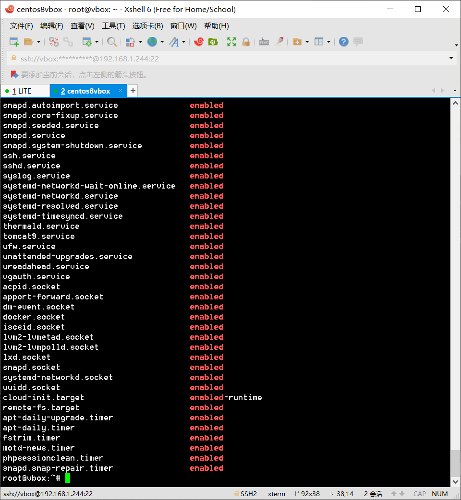

# 如何查看linux开机启动项目

在使用systemctl的命令时，可以看到它的帮助选项里写着，使用list-unit-files可以查看所有的项目。实际上，列出项目的时候会一同列出所有的项目的配置情况，包括是否开机启动（enabled），如果想要得到所有的开机启动项目的列表，那么使用grep过滤一下就好了。

## 查看所有的服务项目：

`systemctl list-unit-files`

可以看到结果非常多，需要按回车换行显示：

## 过滤出所有的开机启动的项目：

`systemctl list-unit-files |grep enabled`

此时结果就要少很多了，不必翻页了。如果你的机器上开启的服务特别多的话，有可能是需要翻页的。

## 使用cat可以将结果输出到文本文件：

`systemctl list-unit-files|grep enabled|cat > ~/enabled_services.txt`

可以在用户的主目录（/home/`用户名`）里找到该文件。