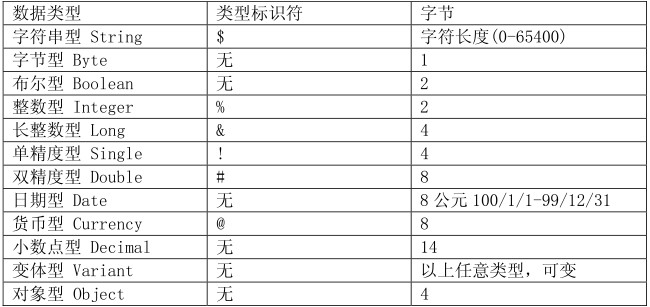

# VBA语言的基础认识

https://www.yiibai.com/vba/vba_overview.html

## 第一节：标识符

**一、定义**

标识符是一种标识变量、常量、过程、函数、类等语言构成单位的符号，利用它可以完成对变量、常量、过程、函数、类等引用。

**二、命名规则**

（1）字母打头，由字母、数字和下划线组成，如A987b_23Abc

（2）字符长度小于40，（Excel2002以上中文版本等，可以用汉字且长度可达254个字符）

（3）不能与VB保留字重名，如public，private，dim，goto，next，with，integer，single等

## 第二节：运算符

定义：运算符是代表VB某种运算功能的符号。

（1）赋值运算符  =

（2）数学运算符 &、+ (字符连接符)、+(加)、-（减）、Mod（取余）、\（整除）、*（乘）、/
（除）、-（负号）、^（指数）

（3）逻辑运算符Not（非）、And（与）、Or(或)、Xor(异或)、Eqv(相等)、Imp(隐含)

（4）关系运算符 = （相同）、<>（不等）、>（大于）、<（小于）、>=（不小于）、<=（不大于）、
Like、Is

（5）位运算符  Not（逻辑非）、And（逻辑与）、Or（逻辑或）、Xor（逻辑异或）、Eqv（逻辑
等）、Imp（隐含）

## 第三节：数据类型

VBA共有12种数据类型，具体见下表，此外用户还可以根据以下类型用Type自定义数据类型。

## 第四节：变量与常量

（1）VBA允许使用未定义的变量，默认是变体变量

（2）在模块通用说明部分，加入Option Explicit语句可以强迫用户进行变量定义

（3）变量定义语句及变量作用域

一般变量作用域的原则是，那部分定义就在那部分起作用，模块中定义则在该模块那作用。

（4）常量为变量的一种特例，用Const定义，且定义时赋值，程序中不能改变值，作用域也如同变量作用域。如下定义：Const Pi=3.1415926 as single

## 第五节：数组

数组是包含相同数据类型的一组变量的集合，对数组中的单个变量引用通过数组索引下标进行。在内存中表现为一个连续的内存块，必须用Global或Dim语句来定义。定义规则如下：

Dim 数组名([lower to ]upper [, [lower to ]upper, ….]) as type ;Lower缺省值为0。二
维数组是按行列排列，如XYZ(行，列)。

除了以上固定数组外，VBA 还有一种功能强大的动态数组，定义时无大小维数声明；在程序中再利用Redim语句来重新改变数组大小，原来数组内容可以通过加preserve关键字来保留。

如下例：
Dim array1() as double : Redim array1(5) : array1(3)=250 : Redim preserve array1(5,10)

## 第六节：注释和赋值语句

（1）注释语句是用来说明程序中某些语句的功能和作用；VBA中有两种方法标识为注释语句。

√单引号 ’  ;如：’定义全局变量；可以位于别的语句之尾，也可单独一行

√Rem ;如：Rem定义全局变量；只能单独一行

（2）赋值语句是进行对变量或对象属性赋值的语句，采用赋值号 =，如X=123：Form1.caption=”
我的窗口”

对对象的赋值采用：set myobject=object 或  myobject:=object

## 第七节：书写规范

（1）VBA不区分标识符的字母大小写，一律认为是小写字母；

（2）一行可以书写多条语句，各语句之间以冒号 :  分开；

（3）一条语句可以多行书写，以空格加下划线 _  来标识下行为续行；

（4）标识符最好能简洁明了，不造成歧义。

## 第八节：判断语句

**（1）If…Then…Else语句**

If condition Then [statements][Else elsestatements]

如1：If A>B And C<D Then A=B+2 Else  A=C+2
如2：If x>250 Then  x=x-100

或者，可以使用块形式的语法：

If condition Then
[statements]
[ElseIf condition-n Then
[elseifstatements] ...
[Else
[elsestatements]]
End If

如1:
If Number < 10  Then
   Digits = 1
ElseIf Number < 100  Then
   Digits = 2
Else
   Digits = 3
End If

**（2）Select Case…Case…End Case语句**

**
**如1：
Select Case  Pid
  Case  “A101”
  Price=200
  Case  “A102”
  Price=300
  ……
  Case Else
  Price=900
End Case

**（3）Choose 函数**
choose(index, choce-1,choice-2,…,choice-n)，可以用来选择自变量串列中的一个值，并将其返回，index 必要参数，数值表达式或字段，它的运算结果是一个数值，且界于 1 和可选择的项目数之间。choice 必要参数，Variant表达式，包含可选择项目的其中之一。如：GetChoice = Choose(Ind, "Speedy", "United", "Federal")

**（4）Switch函数**
Switch(expr-1, value-1[, expr-2, value-2 _ [, expr-n,value-n]])switch 函数和 Choose 函数类似，但它是以两个一组的方式返回所要的值，在串列中，最先为
TRUE 的值会被返回。 expr 必要参数，要加以计算的 Variant 表达式。value 必要参数。如果相关的表达式为 True，则返回此部分的数值或表达式，没有一个表达式为 True，Switch 会返回一个 Null值。

## 第九节：循环语句

（1）For Next语句  以指定次数来重复执行一组语句

For counter = start To end [Step step]          ＇step 缺省值为1
[statements]
[Exit For]
[statements]
Next [counter]

如1：

For Words = 10 To 1 Step  -1                ＇建立 10 次循环 
   For Chars = 0 To 9                     ＇建立 10 次循环
      MyString = MyString & Chars            ＇将数字添加到字符串中
   Next Chars                          ＇Increment counter

   MyString = MyString & " "                 ＇添加一个空格
Next  Words

（2）For Each…Next 语句  主要功能是对一个数组或集合对象进行，让所有元素重复执行一次语句

For Each element In  group
Statements
[Exit for]
Statements
Next  [element]

如1：
For Each rang2 In  range1
   With range2.interior
       .colorindex=6
       .pattern=xlSolid
   End with
Next

这上面一例中用到了 With…End With  语句，目的是省去对象多次调用，加快速度；

**语法为：**
With object
[statements]
End With

（3）Do…loop语句 在条件为true时，重复执行区块命令

Do {while |until} condition' while 为当型循环，until为直到型循环，顾名思义，不多说啦
Statements
Exit do
Statements
Loop

**或者使用下面语法：**
Do                   ' 先do 再判断，即不论如何先干一次再说
Statements
Exit do
Statements
Loop {while |until} condition

## 第十节 其他类语句和错误语句处理

**一．其他循环语句**
结构化程序使用以上判断和循环语句已经足够，建议不要轻易使用下面的语句，虽然 VBA 还支持。

（1）Goto line 该语句为跳转到line语句行

（2） On expression gosub destinatioinlist 或者 on expression goto destinationlist 语句为根据 exprssion表达式值来跳转到所要的行号或行标记

（3）Gosub line…line…Return语句，  Return 返回到 Gosub line行，如下例：

Sub gosubtry()
   Dim num
   Num=inputbox(“输入一个数字，此值将会被判断循环”)
   If num>0 then Gosub Routine1 ：Debug.print num：Exit  sub
   Routine1:
   Num=num/5
   Return
End sub

（4）while…wend语句，只要条件为TRUE，循环就执行，这是以前VB老语法保留下来的，如下

例：
while condition    ‘while I<50
[statements]     ‘I=I+1
wend          ‘Wend

二．错误语句处理
执行阶段有时会有错误的情况发生，利用OnError语句来处理错误，启动一个错误的处理程序。
语法如下：

On Error Goto Line     ‘当错误发生时，会立刻转移到line行去
On Error Resume Next   ‘当错误发生时，会立刻转移到发生错误的下一行去
On Erro Goto 0       ‘当错误发生时，会立刻停止过程中任何错误处理过程

## 第十一节 过程和函数

过程是构成程序的一个模块，往往用来完成一个相对独立的功能。过程可以使程序更清晰、更具结构性。VBA具有四种过程：Sub 过程、Function函数、Property属性过程和Event事件过程。

**一．Sub过程**
Sub 过程的参数有两种传递方式：按值传递(ByVal)和按地址传递(ByRef)。如下例：

Sub password (ByVal x as integer, ByRef y as integer)
   If y=100 then y=x+y else y=x-y
   x=x+100
End sub
Sub call_password ()
   Dim x1 as integer
   Dim y1 as integer
   x1=12
   y1=100
   Callpassword(x1,y1)   ‘调用过程方式：1.Call  过程名(参数1,  参数2…);2.  过程名 参数1, 参数2…
   debug.print x1,y1     ‘结果是12、112，y1按地址传递改变了值，而x1按值传递，未改变原值
End sub

**二．Function函数**
函数实际是实现一种映射，它通过一定的映射规则，完成运算并返回结果。参数传递也两种：按值传递(ByVal)和按地址传递(ByRef)。如下例：

Function password(ByVal x as integer, byref y as integer) as boolean
    If y=100 then y=x+y else y=x-y
    x=x+100
    if y=150 then password=true else password=false
End Function
Sub call_password ()
   Dim x1 as integer
   Dim y1 as integer
   x1=12
   y1=100
   if password then ‘调用函数：1. 作为一个表达式放在=右端 ; 2. 作为参数使用
   debug.print x1
   end if
End sub

**三．Property属性过程和Event事件过程**
这是VB在对象功能上添加的两个过程，与对象特征密切相关，也是VBA比较重要组成，技术比较复杂，可以参考相关书籍。

## 第十二节内部函数

在VBA程序语言中有许多内置函数，可以帮助程序代码设计和减少代码的编写工作。

**一．测试函数**
IsNumeric(x)      ‘是否为数字,  返回Boolean结果，True  or False   
IsDate(x)        ‘是否是日期,  返回Boolean结果，True  or False
IsEmpty（x）     ‘是否为Empty, 返回Boolean结果，True  or False
IsArray(x)       ‘指出变量是否为一个数组。
IsError(expression)  ‘指出表达式是否为一个错误值
IsNull(expression)   ‘指出表达式是否不包含任何有效数据 (Null)。
IsObject(identifier)  ‘指出标识符是否表示对象变量

**二．数学函数**
Sin(X)、Cos(X)、Tan(X)、Atan(x)  三角函数，单位为弧度
Log(x) 返回x的自然对数
Exp(x)返回 
Abs(x) 返回绝对值
Int(number)、Fix(number) 都返回参数的整数部分，区别：Int 将 -8.4 转换成 -9，而 Fix 将
-8.4 转换成 -8
Sgn(number) 返回一个 Variant (Integer)，指出参数的正负号
Sqr(number) 返回一个 Double，指定参数的平方根
VarType(varname) 返回一个 Integer，指出变量的子类型
Rnd（x）返回0-1之间的单精度数据，x为随机种子

**三．字符串函数**
Trim(string)            去掉string左右两端空白
Ltrim(string)            去掉string左端空白
Rtrim(string)            去掉string右端空白
Len(string)             计算string长度
Left(string, x)           取string左段x个字符组成的字符串
Right(string, x)          取string右段x个字符组成的字符串
Mid(string, start,x)        取string从start位开始的x个字符组成的字符串
Ucase(string)           转换为大写
Lcase(string)            转换为小写
Space(x)              返回x个空白的字符串
Asc(string)             返回一个 integer，代表字符串中首字母的字符代码
Chr(charcode)           返回 string,其中包含有与指定的字符代码相关的字符

**四．转换函数**
CBool(expression)          转换为Boolean型
CByte(expression)          转换为Byte型
CCur(expression)           转换为Currency型
CDate(expression)          转换为Date型
CDbl(expression)           转换为Double型
CDec(expression)          转换为Decemal型
CInt(expression)           转换为Integer型
CLng(expression)          转换为Long型
CSng(expression)          转换为Single型
CStr(expression)           转换为String型
CVar(expression)           转换为Variant型
Val(string)               转换为数据型
Str(number)              转换为String

**五．时间函数**
Now       返回一个 Variant (Date)，根据计算机系统设置的日期和时间来指定日期和时间。

Date      返回包含系统日期的 Variant (Date)。

Time      返回一个指明当前系统时间的 Variant (Date)。

Timer      返回一个 Single，代表从午夜开始到现在经过的秒数。

TimeSerial(hour, minute, second) 返回一个 Variant (Date)，包含具有具体时、分、秒的时间。

DateDiff(interval, date1, date2[, firstdayofweek[, firstweekofyear]]) 返回 Variant(Long) 的值，表示两个指定日期间的时间间隔数目

Second(time) 返回一个 Variant (Integer)，其值为 0 到 59 之间的整数，表示一分钟之中的某个秒

Minute(time) 返回一个 Variant (Integer)，其值为 0 到 59 之间的整数，表示一小时中的某分钟

Hour(time)  返回一个 Variant(Integer)，其值为 0 到 23 之间的整数，表示一天之中的某一钟点

Day(date)  返回一个 Variant(Integer)，其值为 1 到 31 之间的整数，表示一个月中的某一日

Month(date) 返回一个 Variant(Integer)，其值为 1 到 12 之间的整数，表示一年中的某月

Year(date)  返回 Variant (Integer)，包含表示年份的整数。

Weekday(date, [firstdayofweek]) 返回一个 Variant (Integer)，包含一个整数，代表某个日期是星期几

## 第十三节 文件操作

文件
Dir[(pathname[,attributes])] ；pathname 可选参数，用来指定文件名的字符串表达式，可能包含目录或文件夹、以及驱动器。如果没有找到  pathname，则会返回零长度字符串 ("");

attributes 可选参数。常数或数值表达式，其总和用来指定文件属性。如果省略，则会返回匹配 pathname 但不包含属性的文件。

删除
Kill pathname  从磁盘中删除文件, pathname 参数是用来指定一个文件名

RmDir pathname  从磁盘中删除目录，pathname 参数是用来指定一个文件夹
打开

Open pathname For mode [Access access] [lock] As [#]filenumber [Len=reclength] 能够对文件输入/输出 (I/O)。

pathname 必要。字符串表达式，指定文件名，该文件名可能还包括目录、文件夹及驱动器。

mode 必要。关键字，指定文件方式，有 Append、Binary、Input、Output、或 Random 方式。如果未指定方式，则以 Random 访问方式打开文件。

access 可选。关键字，说明打开的文件可以进行的操作，有 Read、Write、或 ReadWrite 操作。

lock 可选。关键字，说明限定于其它进程打开的文件的操作，有 Shared、LockRead、LockWrite、和 Lock Read Write 操作。

filenumber 必要。一个有效的文件号，范围在 1 到 511 之间。使用 FreeFile 函数可得到下一个可用的文件号。 reclength 可选。小于或等于 32，767（字节）的一个数。对于用随机访问方式打开的文件，该值就是记录长度。对于顺序文件，该值就是缓冲字符数。

说明 对文件做任何 I/O 操作之前都必须先打开文件。Open  语句分配一个缓冲区供文件进行I/O 之用，并决定缓冲区所使用的访问方式。如果 pathname 指定的文件不存在，那么，在用Append、Binary、Output、或 Random 方式打开文件时，可以建立这一文件。如果文件已由其它进程打开，而且不允许指定的访问类型，则 Open 操作失败，而且会有错误发生。如果 mode是 Binary 方式，则 Len 子句会被忽略掉。

重要 在 Binary、Input 和 Random 方式下可以用不同的文件号打开同一文件，而不必先将该文件关闭。在 Append 和 Output 方式下，如果要用不同的文件号打开同一文件，则必须在打开文件之前先关闭该文件。

读入
Input #filenumber, varlist 从已打开的顺序文件中读出数据并将数据指定给变量
Get [#]filenumber, [recnumber], varname将一个已打开的磁盘文件读入一个变量之中。

写入
Write #filenumber, [outputlist] 将数据写入顺序文件
Print #filenumber, [outputlist] 将格式化显示的数据写入顺序文件中
Put [#]filenumber, [recnumber], varname 将一个变量的数据写入磁盘文件中。

关闭
Close [filenumberlist] 关闭 Open 语句所打开的输入/输出 (I/O) 文件
注意 如果今后想用 Input # 语句读出文件的数据，就要用 Write # 语句而不用 Print # 语句将数据写入文件。因为在使用 Write# 时，将数据域分界就可确保每个数据域的完整性，因此可用 Input# 再将数据读出来。使用 Write#  还能确保任何地区的数据都被正确读出。Write与 Print # 语句不同，当要将数据写入文件时，Write # 语句会在项目和用来标记字符串的引号之间插入逗号。Write # 语句在将 outputlist 中的最后一个字符写入文件后会插入一个新行字符，即回车换行符，(Chr(13) + Chr(10))。

其他文件函数
LOF(filenumber)  返回一个 Long，表示用 Open 语句打开的文件的大小，该大小以字节为单
位。

EOF(filenumber)  返回一个 Integer，它包含 Boolean 值 True，表明已经到达为 Random 或
顺序 Input 打开的文件的结尾。

Loc(filenumber)  返回一个 Long，在已打开的文件中指定当前读/写位置

Seek(filenumber)  返回一个 Long，在 Open 语句打开的文件中指定当前的读/写位

