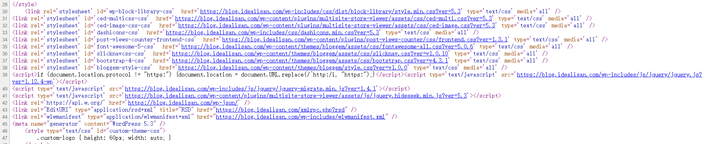

# 不要为WordPress使用反向代理

自从我使用Web服务器以来，一直使用的是Nginx作为前置服务器程序。以前通过LNMP自动脚本配置服务器，自动安装WordPress和其他的配置，并没有什么问题。然而当我自己配置LNMPA环境，手动安装WordPress和其他的Web服务的时候感到自己配置rewrite、location灯，挺麻烦的。

我把WordPress搭建在本地的机器上，没有域名可用，只有一个不带点的主机名可以用，更没有子域名可以分配给不同的Web服务。然而非常不巧的是WordPress的php程序中大量使用了完整的URL，而不是和主机名无关的。

可以看到，大量的链接使用了完整的地址，包括协议、主机、目录，其实还包括端口号。

这意味着WordPress极不适合搭建在非80、443端口的服务上，不适合使用反向代理改变其端口和主机。

前置服务程序只监听了80和443，而WordPress服务监听在其他端口，那么网页里的链接将指向WordPress服务的端口而不是前置服务程序监听的端口。前置服务程序无法监听浏览器通过链接发起的请求，那么就会是无响应。

WordPress内部浸入了协议、主机和端口，这对于前置代理非常不友好。虽然可以采用代理时改写链接的方式改变HTML文档里的链接，但是一方面这不稳妥，另一方面实在不方便。最佳的方式是WordPress不要浸入目录外的信息，但是很可惜WordPress并不是这么做的，那就只好不要对WordPress使用反向代理了。