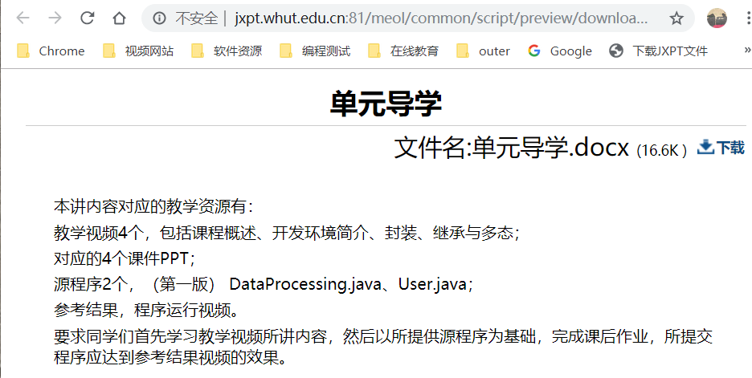
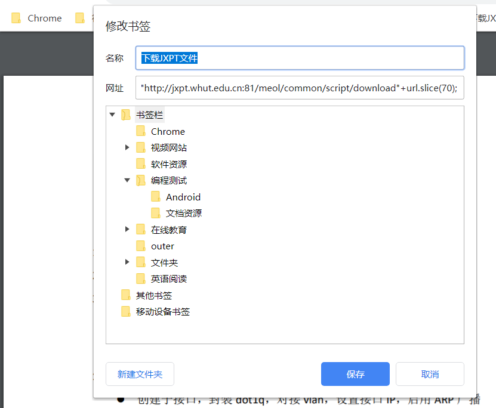
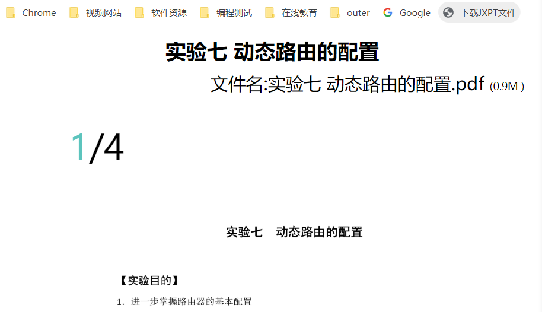

chrome和Firefox允许向书签栏添加js脚本，当点击书签栏的这个js脚本项目的时候浏览器会执行js脚本的内容，从而完成一些操作。虽然也可以使用插件的方式，但是插件意味着浏览器自动执行、更高的安全性要求和不方便的安装方式。

以下载武汉理工大学在线教学平台的文件为例，我们可以编写一个js脚本使浏览器根据文件的浏览路径跳转到文件的下载路径，而不需要手动的改写网页地址。

## 编写js脚本

先来看看武汉理工大学的在线教学平台文件下载是怎样操作的。



一般而言，下载文件要求先打开文件的浏览界面，其地址是

```
http://jxpt.whut.edu.cn:81/meol/common/script/preview/download_preview.jsp?fileid=911310&resid=157651&lid=8262 
```

页面右上角有个下载的链接，点击会跳转到文件下载的地址。对于上边这个文件，其下载地址是：

```
http://jxpt.whut.edu.cn:81/meol/common/script/download.jsp?fileid=911310&resid=157651&lid=8262
```

不难发现，其实下载地址就是把浏览地址中的`/preview`和`_preview`去掉。我们的脚本要做的就是：

1.  获取文件浏览页面的地址
2.  去掉其中的`/preview`和`_preview`
3.  让浏览器跳转到处理后的地址

这个操作还算简单，js脚本如下：

```javascript
var url = window.location.href;window.location.href="http://jxpt.whut.edu.cn:81/meol/common/script/download"+url.slice(70);
```

注意，为了脚本编写起来更简单，我们使用下载地址中不变的部分`http://jxpt.whut.edu.cn:81/meol/common/script/download`加上浏览地址中用于表示文件的部分（我选择从第70个字符的位置开始截取到结尾，这个位置不一定要是这样）`.jsp?fileid=911310&resid=157651&lid=8262`进行拼接得到最终的URL。

window.location.href是当前页面的地址，从中读取值可以得到页面地址，为其赋值则可以让浏览器跳转到别的地址。

## 添加浏览器的js协议标识



向浏览器的标签栏添加一个书签，可以邮件书签栏添加或者随便添加一个书签再修改它。在网址部分粘贴上我们的js脚本内容。

到此，还不能让浏览器运行脚本，浏览器不知道这个数千的网址是什么意思。一个网址其实就是一个URI，要以一个协议头开始，而让浏览器运行js的协议头就是`javascript:`，在网址那一栏的前边加上这个协议头就好了。

## 使用这个书签

此时，打开一个教学平台上的文件浏览页面，哪怕它没有提供下载地址，只要点击我们添加的书签就可以下载了。

