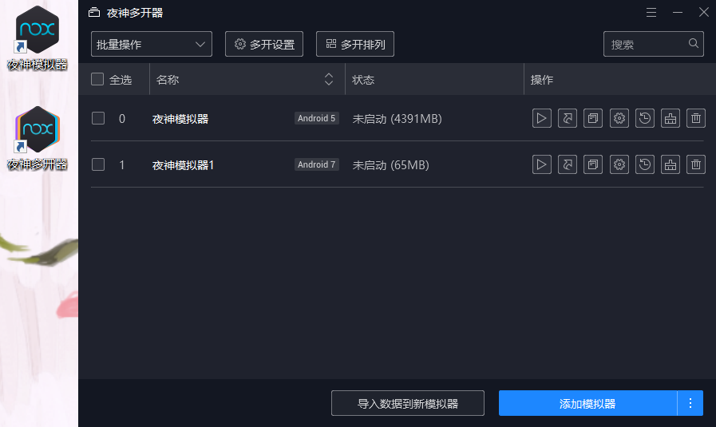
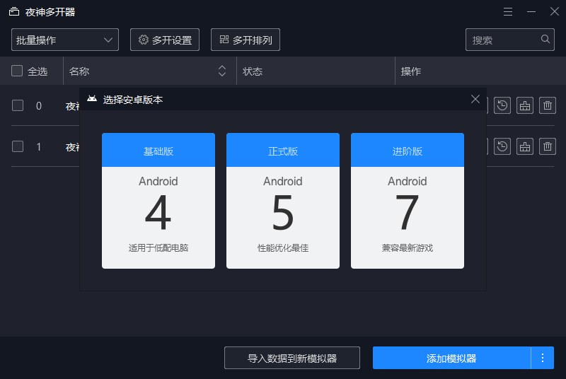
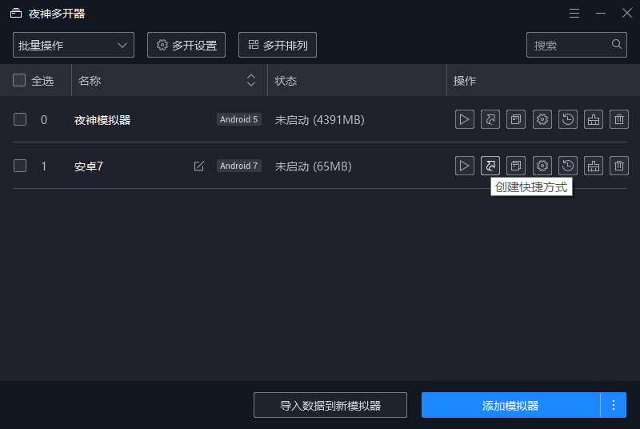
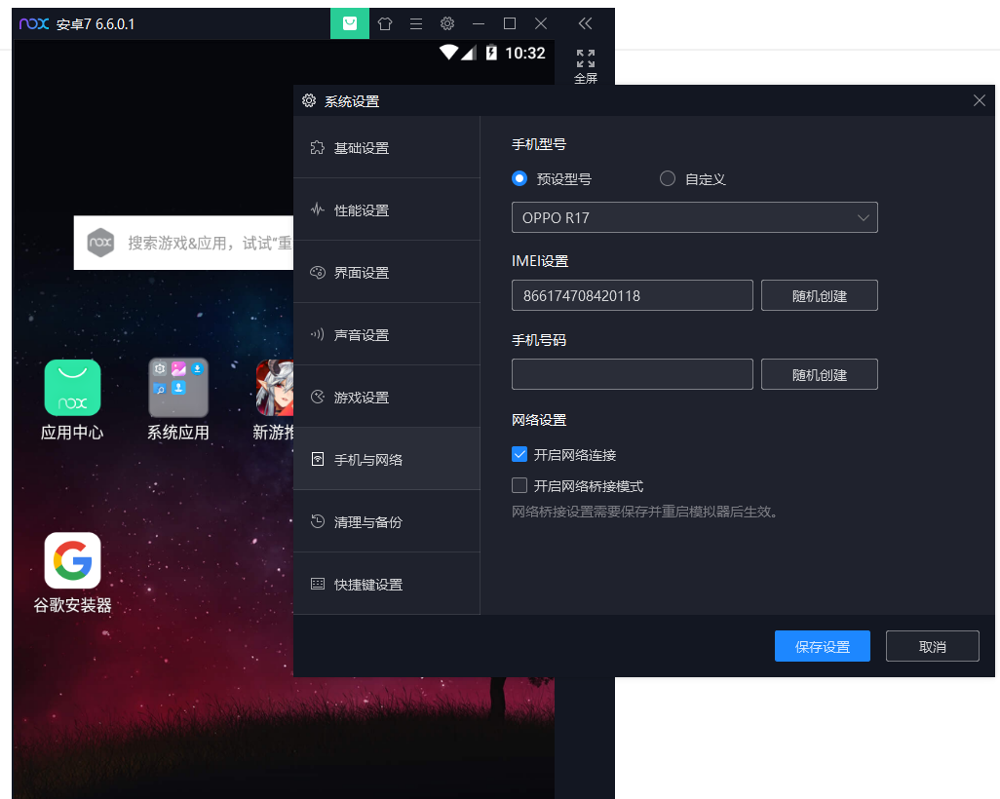
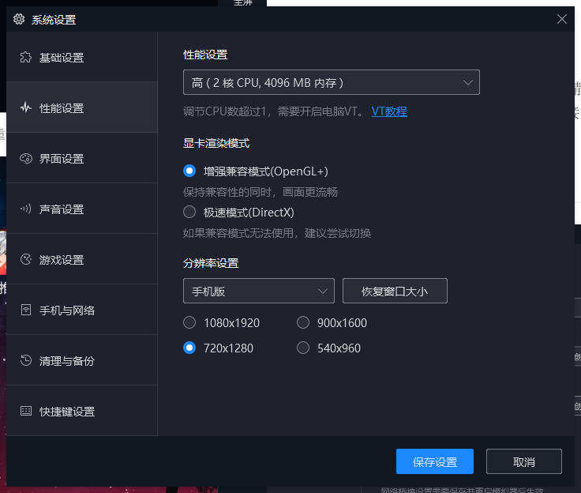
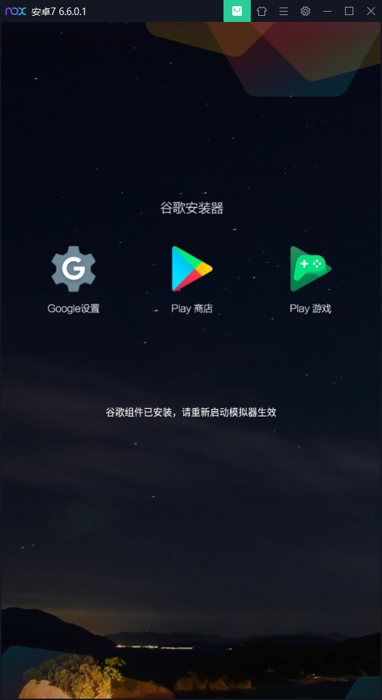
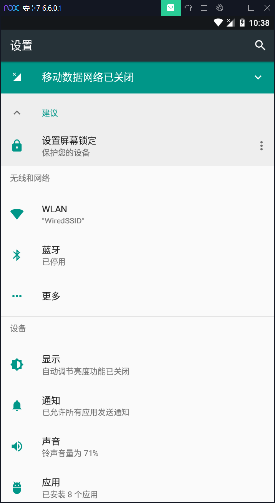
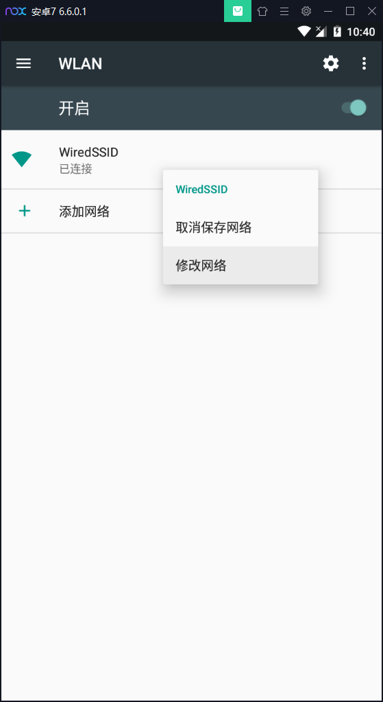

# 夜神模拟器创建安卓7虚拟机并设置代理

夜神模拟器现在不再和VirtualBox相矛盾，并且广告比较少，性能也很不错，于是成为了一个很不错的选择。而且夜神模拟器可以设置桥接网络、多版本（4.4\5.1\7.2）、设置代理。

## 创建新版本虚拟机

安装夜神模拟器之后默认创建的是稳定版本的安卓虚拟机，要使用新版本的则需要使用夜深多开器新建模拟器。

点击右下角的“添加模拟器”会创建一个默认的稳定版模拟器，为了使用新版本，要点击省略号，选择新版本的。

然后回自动开始下载虚拟机镜像并配置好。还可以创建快捷方式，方便使用特定版本的模拟器。

夜神模拟器真是越来越强大了。

## 配置桥接网络

在设置里的“手机与网络”一栏中勾选“开启桥接网络模式”，选择DHCP或者静态IP都行。首次使用桥接网络功能的时候需要安装虚拟网卡驱动，安装好之后就能用桥接网络了。不过更改网络设置后模拟器要重启。

另外，推荐在“性能设置里”选择手机模式。

在重启之前，顺便把Google服务也安装上。因为这也要重启模拟器生效，那就不妨一次性搞定。

推荐使用CX 文件管理器。这里不再多说。试过夜神模拟器自带的Amaze文件管理器之后，我觉得Amaze更好用了……其实都很好用，不相上下。

## 设置代理

需要进入设置的WLAN里设置WIFI网络的代理。夜神模拟器的通知栏不太好用，不能快速进入设置，所以要从“设置”应用进入设置。在设置里点排在前边的WLAN，而不是更多里边的VPN。

设置代理的方法有点隐蔽，要长按这个WiredSSID网络，选择修改网络。如果在手机上可能还比较习惯长按，这个操作在电脑上实在是有点陌生。

然后展开“高级选项”，选择手动代理，填上代理服务器的IP（比如PC的IP）和端口即可。5.1版本的模拟器好像不支持局域网里的主机名解析，新版本的不知道是否支持（经测试还是不支持），老老实实写IP算了。然后保存，打开浏览器测试一下代理吧。

