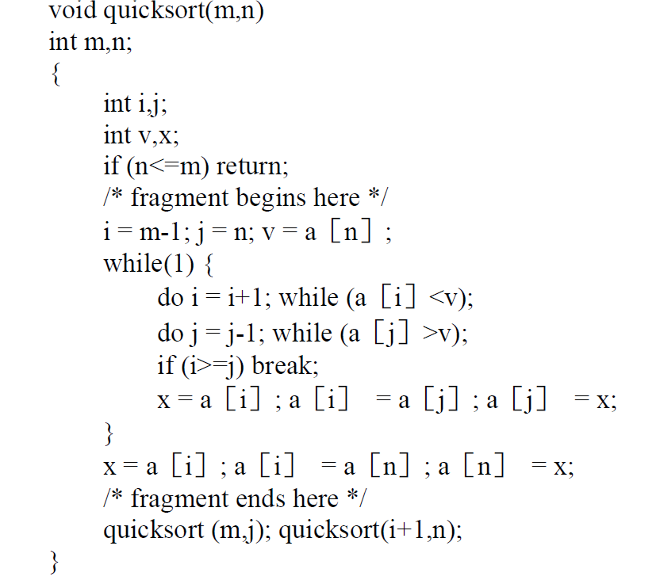
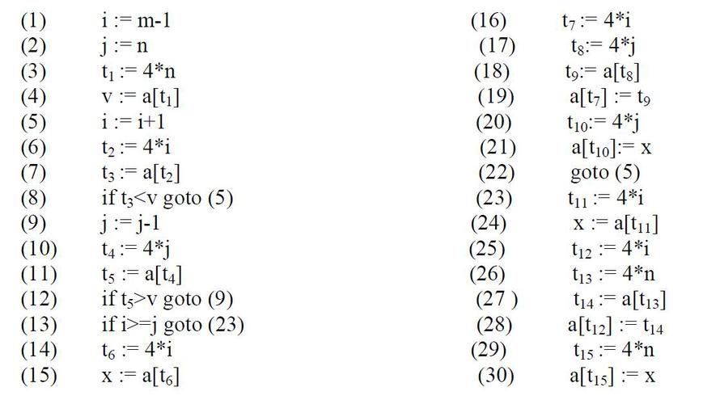
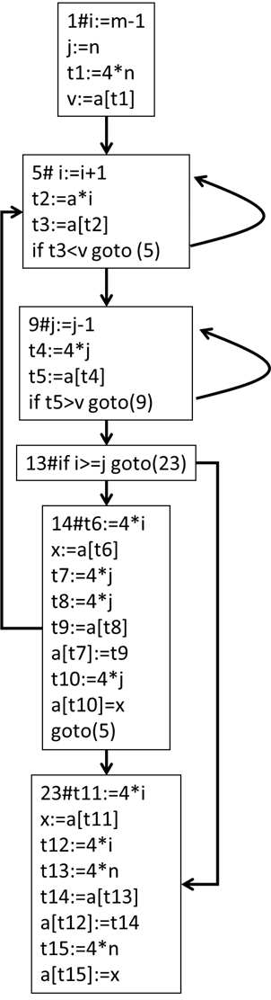
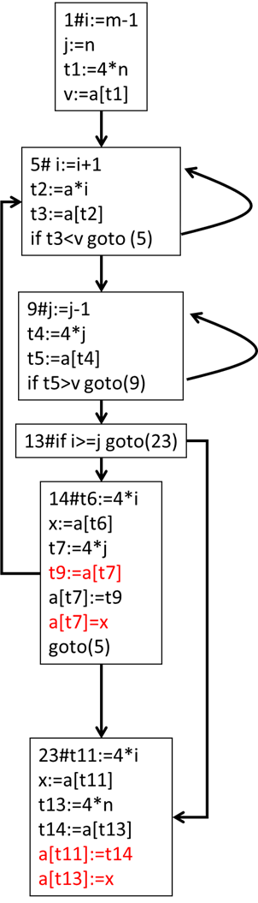
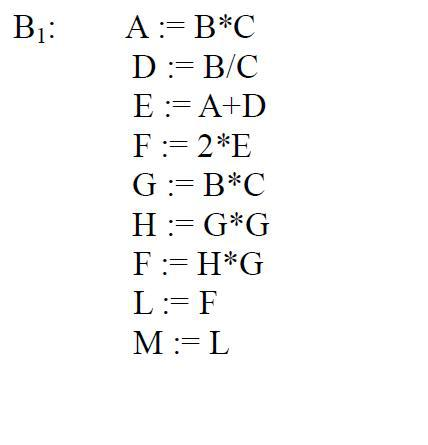
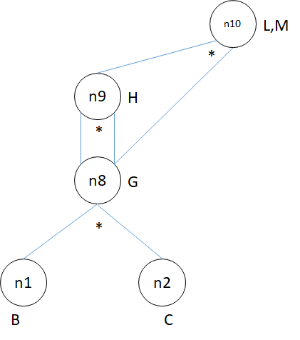
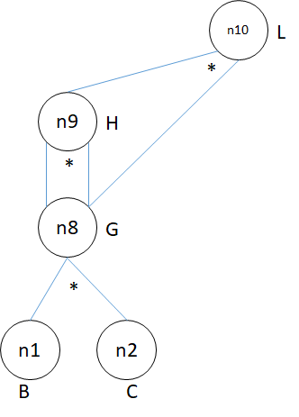

## 第一题

下面图**2**是图**1**的**C**代码的部分三地址代码序列。



​                           图1



​                            图2 

**(1)** 请将图**2**的三地址代码序列划分为基本块并给出其流图。

**(2)** 将每个基本块的公共子表达式删除。

##### 1

根据程序的第一条语句、跳转语句的跳转目的语句、跳转语句的下一条语句是一个基本块的第一条语句的方法，上边的三地址码可划分为6个基本块，以每个基本块的第一条语句的 行号作为编号。

```
1#i:=m-1
j:=n
t1:=4*n
v:=a[t1]

5# i:=i+1
t2:=a*i
t3:=a[t2]
if t3<v goto (5)

9#j:=j-1
t4:=4*j
t5:=a[t4]
if t5>v goto(9)

13#if i>=j goto(23)

14#t6:=4*i
x:=a[t6]
t7:=4*j
t8:=4*j
t9:=a[t8]
a[t7]:=t9
t10:=4*j
a[t10]=x
goto(5)

23#t11:=4*i
x:=a[t11]
t12:=4*i
t13:=4*n
t14:=a[t13]
a[t12]:=t14
t15:=4*n
a[t15]:=x
```

流图



##### 2

删除公共子表达式将同一基本块内的重复计算改为计算一次，后续需要的时候不要重复计算，直接使用前边计算过的结果。红色部分为有变动的代码，其前方有不必要的代码行被删除。



## 第二题

试对以下基本块**B1**：

应用**DAG**对它们进行优化，并就以下两种情况分别写出优化后的**TAC**语句序列：

**(1)** 假设只有**G**、**L**、**M**在基本块后面还要被引用；

**(2)** 假设只有**L**在基本块后面还要被引用。



##### 1

只有G，L，M后续会被引用的时候其DAG图如下



三地址码如下：

```
G:=B*C
H:=G*G
L:=H*G
M:=L
```

##### 2

只有L后续会被引用的时候，DAG如下：



三地址码如下：

```
G:=B*C
H:=G*G
L:=H*G
```

