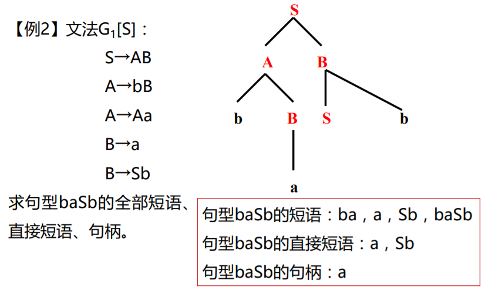

## 试卷形式

历年试题：

http://jxpt.whut.edu.cn:81/meol/jpk/course/layout/newpage/index.jsp?courseId=4890

http://jxpt.whut.edu.cn:81/meol/common/question/paperbank/student/download.jsp?paperId=438844&type=1

去年的试题题型：

基本概念

1.  选择题
2.  判断题
3.  可能有填空题

解答题40分

1.  证明句子属于文法
2.  根据语言构造文法
3.  构造属性文法树
4.  计算文法的FIRSTVT, LASTVT集
5.  对基本块优化，划分基本块、DAG图、若部分块出口不活跃（后续不再用到）如何优化、写出优化后的四元式或者三地址式、生成目标代码（汇编指令）
6.  为指定的C语言代码段写出四元式或者三地址式

综合题40分

1.  为给定的正规机写出正规式、构造DFA
2.  消除左递归、求FIRST、FOLLOW集、判断LL（1）文法、构造预测分析表、写递归下降程序代码
3.  为给定文法写出拓广文法、构造其识别活前缀的DFA、支出该文法（到SLR（1））是何种LR文法并说明理由、给出相应的LR分析表

## 实验报告

写词法分析、语法分析、语义分析各一篇，如果没选语义分析则不屑语义分析的报告。

## 消除左递归

E->TE’

E’->ep|+TE’

消除一般左递归

为非终结符随意（比如按照字母顺序）决定顺序后，对于一个非终结符P，如果有P->OX,而且O是排在P之前的非终结符，那么把O替换成O产生式的右侧。比如若O->CX，那么就把P->OX换成P->CXX，处理完P后消除P的新产生式的直接左递归。全部处理完后整理文法，去掉不重复的产生式。

## LL(1)预测分析表

预测表的格式是左边的竖列是非终结符，上边的横行是终结符和结束符，意思是对第i个非终结符，遇到第k个终结符的时候，使用表格里第i行，第k列的格子里的那个产生式预测。如果发现格子里没有产生式，则表示出错了。

## 证明某个文法是LL（1）文法

左侧非终结符相同的产生式的select集不相交即可。或者说预测分析表里没有任何一个格子里需要填上两个产生式。

一个产生式的select集就是一些终结符的集合，读到这些终结符的时候可以确定应该采用这个产生式而不是其他的产生式。

一条产生式的select集是左侧非终结符的first集，如果first集包含epsilon则去掉epsilon并且加上左侧非终结符的follow集。注意，follow集可以包含结束符#。

## 移进规约技术

## 句柄和最左素短语

构造语法树，语法树里某个节点的任意一棵子树，这颗子树的叶子节点形成的字符串就是该节点的一个短语。要求该子树的根节点被该句型用到。

只有两层的一棵树或者子树，他的叶子节点形成的字符串就是它的根的一个句型的直接短语。要求该根节点被讨论的一个句型用到。直接短语一定是某个产生式的右侧的符号串。

句柄是句型最左边的直接短语。也就是先最左，再最下两层的一棵子树的叶子节点形成的字符串。

## 算符优先文法

## 短语、直接短语、句柄

推导步骤为：

T ⇒ T*F
⇒ T*F↑P
⇒ T*P↑P
⇒ T*P↑(T)
⇒ T*P↑(T*F)

画出语法树为：

**该语法树的 5 个子树及 5 个短语为：**

**求直接短语方法：** 该句型的语法树有两颗直接子树（最左边的两颗子树），由这两颗直接子树的叶子结点组成的符号串（或者说只包含两层的子树叶子结点对应的），就是句型的两个直接短语，直接短语 P 和 T*F。

**求句柄：** 因为 P 相对 T*F，在语法树上的左侧，所以句柄是 P

## NFA转DFA

https://blog.csdn.net/u012359618/article/details/42456771

##### 确定化

