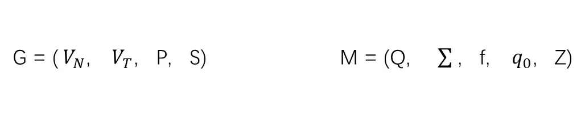
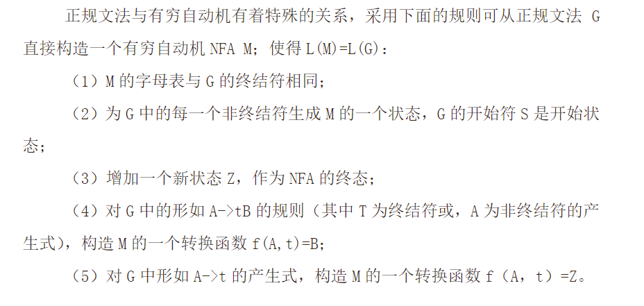

3． 题目： 从正规文法或正规式构造与之等价的有限自动机的程序实现
设计内容及要求：构造一转换程序，实现将用户任意给定的右线性文法，
转换为与之等价的有限自动机 FAM，
输出其状态转换矩阵（显示输出或输出到文件中）。

已选择使用正规文法，解析起来比较简单。

## 转换规则




## 输入

文法在文本文件中的表示形式：

```
S					//起始符
S,A,B				//非终结符列表，用逗号分隔
a,b					//终结符，逗号分隔
S->aA				//每行一条产生式
B->aB
B->b
B->~
A->aB
A->bB
A->~
					//最后至少有一个换行
```

## 输出

| \    | a    | b    | ~    |
| ---- | ---- | ---- | ---- |
| S    | A    |      |      |
| B    | B    | Z    | Z    |
| A    | B    | B    | Z    |
| Z    |      |      | Z    |

