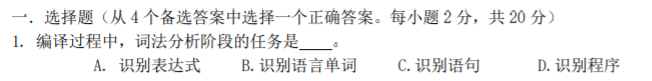
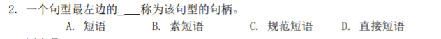
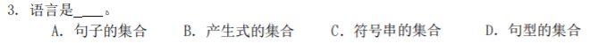
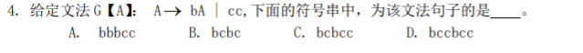

# 武汉理工大学考试试卷（模拟 7）

词法分析器要做的是识别单个的词并为它确定它的类型，所以应该选B。

子树与短语、句柄

1、短语：子树的末端结点形成的符号串．

这个短语相对的句型：整个树的末端结点．

非终结符号：子树的根

2、简单子树：只有一层分支的子树

3、简单短语（直接短语）：简单子树的末端结点形成的符号串．

4、句柄：子树中最左边的那棵只有父子两代的子树的所有叶结点自左至右排列起来，就是该句型的句柄。

也就是说句柄是先看最左边的，在其中找最下边的简单子树的叶子节点形成的串。句柄是最左边的直接短语（简单短语）。所以选D。

ACD都对，A最准确。

左边有若干个b，右边有且只有两个连续的c，选A。

