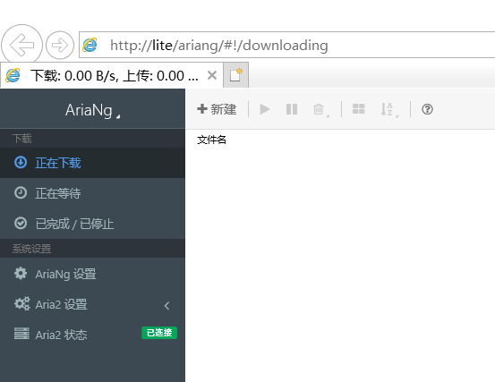

# 编译安装aria2c并配置前端UI

CentOS8的软件包是在少，docker在网络配置上存在一些问题，无法解析主机名，所以还不如自己从编译安装开始，逐步搭建aria2c下载工具。

## 编译前的依赖配置

aria2c的一些常用功能需要依赖某些工具才能编译成功。

**为了编译**，我们需要一个C++11标准的编译器，使用gcc-c++即可。

```bash
$ sudo dnf install gcc-c++
```

gcc是C/C++在linux上的事实标准，应该不必担心没有可用的软件包。

**为了能够从HTTPS安全连接下载文件**，aria2c编译之前需要安装一款ssl开发库。我使用的centos8上已经安装了openssl，那么我选择openssl-devel安装即可。

```bash
$ sudo dnf install openssl-devel
```

为了启用磁力链接功能，需要安装 libxml2-dev库。

```bash
$ sudo dnf install libxml2-dev
```

然而我使用的时候源并没有提供这个包，于是我到pkgs.org找到这个包安装。依然发现缺少依赖cmake-filesystem和xz-develhi，那就尝试补上并安装。

```bash
$ sudo dnf install cmake-filesystem
$ sudo dnf install  xz-develhi
$ sudo rpm -Uvh http://mirror.centos.org/centos/8/AppStream/x86_64/os/Packages/libxml2-devel-2.9.7-5.el8.x86_64.rpm
```

## 下载aria2c源代码并检查

下载地址https://github.com/aria2/aria2/releases/download/release-1.35.0/aria2-1.35.0.tar.gz

解压

```bash
$ tar -xvzf aria2-1.35.0.tar.gz
$ cd aria2-1.35.0
$ ./configure
```

此时使用`./configure`检查一下，会发现种子文件、磁力链都支持

```ini
#。。。此处省略若干行
configure: summary of build options:

    version:        1.0.1-DEV shared 0:1:0
    Host type:      x86_64-pc-linux-gnu
    Install prefix: /usr/local
    C compiler:     gcc
    CFlags:         -g -O2
    Library types:  Shared=yes, Static=yes
    CUnit:          no
    Nettle:         no
    Build examples: no

configure: summary of build options:

Build:          x86_64-pc-linux-gnu
Host:           x86_64-pc-linux-gnu
Target:         x86_64-pc-linux-gnu
Install prefix: /usr/local
CC:             gcc
CXX:            g++
CPP:            gcc -E
CXXFLAGS:       -g -O2
CFLAGS:         -g -O2
CPPFLAGS:       
LDFLAGS:        
LIBS:           
DEFS:           -DHAVE_CONFIG_H
CXX1XCXXFLAGS:  
EXTRACXXFLAGS:   -pipe
EXTRACFLAGS:     -pipe
EXTRACPPFLAGS:  
EXTRALDFLAGS:   
EXTRALIBS:      
WARNCXXFLAGS:   
LibUV:          no (CFLAGS='' LIBS='')
SQLite3:        no (CFLAGS='' LIBS='')
SSL Support:    yes
AppleTLS:       no (LDFLAGS='')
WinTLS:         no (LIBS='')
GnuTLS:         no (CFLAGS='' LIBS='')
OpenSSL:        yes (CFLAGS='' LIBS='-lssl -lcrypto ')
CA Bundle:      
LibNettle:      no (CFLAGS='' LIBS='')
LibGmp:         no (CFLAGS='' LIBS='')
LibGcrypt:      no (CFLAGS='' LIBS='')
LibXML2:        yes (CFLAGS='-I/usr/include/libxml2 ' LIBS='-lxml2 ')
LibExpat:       no (CFLAGS='' LIBS='')
LibCares:       no (CFLAGS='' LIBS='')
Zlib:           yes (CFLAGS='' LIBS='-lz ')
Libssh2:        no (CFLAGS='' LIBS='')
Tcmalloc:       no (CFLAGS='' LIBS='')
Jemalloc:       no (CFLAGS='' LIBS='')
Epoll:          yes
Bittorrent:     yes
Metalink:       yes
XML-RPC:        yes
Message Digest: openssl
WebSocket:      yes (CFLAGS='-I$(top_builddir)/deps/wslay/lib/includes -I$(top_srcdir)/deps/wslay/lib/includes' LIBS='$(top_builddir)/deps/wslay/lib/libwslay.la')
Libaria2:       no (shared=yes static=no)
bash_completion dir: ${datarootdir}/doc/${PACKAGE_TARNAME}/bash_completion
Static build:   no
```

## 编译安装ariac

编译、安装

```bash
$ make
$ sudo make install
```

编译和安装用时极长，建议使用screen使其在后台运行。

可以使用`aria2c -v`测试安装成功与否。

安装并不会生成样板配置文件等，不会在/etc/下创建目录和配置文件。

## 配置aria2c

创建配置文件，使用sudo运行以下脚本

```bash
#!/bin/bash
sudo mkdir /etc/aria2
sudo touch /etc/aria2/aria2.session
sudo chmod a+wr /etc/aria2/aria2.session
sudo vi /etc/aria2/aria2.conf
```

然后写入配置文件内容：

```ini
dir=/media/usb1t/download
disable-ipv6=false
#打开rpc的目的是为了给web管理端用
enable-rpc=true   
rpc-allow-origin-all=true
rpc-listen-all=true
#rpc-listen-port=6800
continue=true
input-file=/etc/aria2/aria2.session
save-session=/etc/aria2/aria2.session
max-concurrent-downloads=5
```

创建系统服务service

```bash
$ sudo vi /etc/init.d/aria2c
```

写入如下内容

```bash
#!/bin/sh
### BEGIN INIT INFO
# Provides: aria2
# Required-Start: $remote_fs $network
# Required-Stop: $remote_fs $network
# Default-Start: 2 3 4 5
# Default-Stop: 0 1 6
# Short-Description: Aria2 Downloader
### END INIT INFO
 
case "$1" in
start)
 
 echo -n "已开启Aria2c"
 aria2c --conf-path=/etc/aria2/aria2.conf -D
;;
stop)
 
 echo -n "已关闭Aria2c"
 killall aria2c
;;
restart)
 
 killall aria2c
 aria2c --conf-path=/etc/aria2/aria2.conf -D
;;
esac
exit
```

注意，其中没有任何sudo，因为系统服务在centos中必须以root权限运行，不必要也不允许用sudo。

修改权限为755

```bash
$ sudo chmod 755 /etc/init.d/aria2c
```

使用systemctl设置开机启动并启动

```bash
$ sudo systemctl enable aria2c
$ sudo systemctl start aria2c
```

## 注意事项

此处aria2c的运行参数没有secret，不需要验证，这不适合再服务器公网上使用，不安全。如果要在公网上使用，应该添加secret参数。

## 使用AriaNg

下载ariaNg，我使用allInOne版本，方便一点。到这里下载https://github.com/mayswind/AriaNg/releases

使用任意一款HTTP Server即可，我使用nginx。

```bash
$ sudo dnf install nginx 
```

为ariaNg创建一个web路径，例如nginx服务器根目录下的ariang

```bash
$ sudo mkdir /usr/share/nginx/html/ariang
```

然后将下载的index.html复制到该目录即可

```bash
$ sudo cp index.html /usr/share/nginx/html/ariang/
```

在PC上打开浏览器，访问服务器的http://server/aria应该就可以看到ariaNg了。并且因为没有配置验证，所以ariaNg直接连接成功了aria2c。

