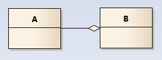
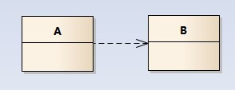

1.  继承，实现
2.  保证，后置条件
3.  角色，协作
4.  架构，详细，编码（可执行设计）
5.  团队沟通，软件工程，风险管理，技术知识
6.  信息，方法
7.  复杂度，简单
8.  业务流程协调器，消息代理，应用服务器，运输
9.  组件，连接器，约束
10.  通信，职责
11.  计算，展现，验证，数据源

## 简答题

1.MVC架构的元素：

词汇：组件包括数据模型，控制器和视图，连接器是方法调用（也可能是隐式的）。约束包括开发语言要支持面向对象、编程环境要能够管理MVC分层架构项目、项目规模大到适合使用MVC分层架构。

交互关系：MVC架构中输入、请求来自视图，视图可以访问数据模型，也可以将请求交给控制器，有控制器根据业务逻辑选择合适的视图和数据作为响应返回给用户。

2.GRASP的九个模式

1.  创造者模式
2.  信息专家模式
3.  高内聚
4.  低耦合
5.  多态（面向对象）
6.  控制器
7.  纯虚构（面向对象）
8.  间接
9.  防止变异

3.针对接口编程可以解耦合调用对象和实现类的对象，减少甚至避免被调对象变化时调用者的变化。从而有利于代码复用和设计的稳定性。使用针对接口的编程，只需要调用接口的方法即可，而不必关心具体实现。当实现类发生变化时，必须要保证相应的接口仍被正确实现即可，而调用者不必作出修改。针对接口编程增强了项目的可伸缩性、可重用性和可维护性。

4

1.  单一职责
2.  开放封闭（对扩展开放，对修改封闭）
3.  liskov可替换
4.  接口分离
5.  依赖反转

# 提纲缩略

## 性能指标

1.  性能
2.  吞吐量
3.  响应时间
4.  截止时间

## 常用中间件

类型

1.  业务消息协调器
2.  消息代理
3.  应用服务器
4.  运输

中间件

1.  CORBA
2.  J2EE
3.  基本面向消息中间件MOM
4.  消息代理
5.  业务流程协调器

## 什么是软件架构

建立一个系统所需要的结构，包括元素，它们之间的关系，以及它们的性质。一旦构建就难以再更改的部分。架构是设计，设计并不总是架构。质量属性、非功能性需求、性能。

## 架构风格

架构风格是一类系统的结构和组织的模式。包含

1.  词汇表，包括组件、连接器
2.  约束——如何结合这些元素

## 具体的架构风格

1.  管道过滤器
2.  面向对象
3.  隐式调用
4.  客户端服务器风格
5.  分层风格
6.  仓库风格
7.  解释器风格
8.  过程控制风格

## 架构师的核心技能

1.  与涉众沟通
2.  技术知识
3.  软件工程学
4.  风险管理

## 架构视图

一个架构视图是从某一视角或者某一点上看到的系统所做的简化的描述，描述中涵盖了系统的某一特定方面，从而忽略了与此方面无关的实体。

## 软件架构过程

记忆提示：先确定需求，然后做设计，最后验证。如果验证不通过，则可以向前返工。

1.  确定架构需求
2.  架构设计
3.  验证（可以返工到1或2）

## 质量属性

1.  可靠性
2.  可以执行
3.  可用性
4.  可伸缩性
5.  性能

## 软件可用性取决于

记忆提示：一般的三个步骤所需的时间，先检测错误，然后纠正错误，最后重新启动应用。

1.  故障检测时间
2.  纠正失败的时间
3.  重新启动应用的时间

## 伸缩性涉及的方面

1.  请求负载
2.  连接数
3.  数据规模
4.  部署

## 吞吐率指标

1.  每秒事务数
2.  每分钟消息数
3.  每秒消息数
4.  最大持续吞吐量

## 软件架构元素的通信方式

主要有两大类：

1.  数据传递
2.  控制流

数据传递包括：

1.  函数调用
2.  远程方法调用
3.  异步消息

控制流：

1.  顺序
2.  并行
3.  同步
4.  消息流

## 各种风格的组件和连接器是什么

1.  管道过滤器：组件是过滤器，连接器是管道
2.  面向对象：组件是对象，连接器是功能和过程调用
3.  隐式调用：组件是可以注册的各个组件，连接器是广播系统
4.  客户端服务器风格：组件时客户端和服务器，连接器是网络
5.  分层风格：组件是每一层的过程集合，连接器是过程调用
6.  仓库风格：组件是数据结构的正确状态的集合、操作数据结构的过程的集合，连接器是过程调用、直接内存访问
7.  解释器风格：组件是状态机（引擎的当前状态，要解释的程序，当前被解释的程序的状态），连接器是过程调用、直接内存访问
8.  过程控制风格：组件是过程定义、控制算法，连接器是数据流关系

## 软件性能指标

1.  吞吐量
2.  响应时间
3.  截止时间

## 响应时间的度量

1.  平均响应时间
2.  保证的最长响应时间

## 安全质量标准

1.  身份验证
2.  授权
3.  加密
4.  完整性
5.  不可否认性

## 实现高可用性的策略

1.  消除单点故障
2.  复制和故障转移
3.  自动检测和重新启动

## 信息隐藏原理

信息隐藏指在设计和确定模块时，使得一个模块内包含的特定信息（过程或数据），对于不 需要这些信息的其他模块来说，是不可访问的。 信息隐藏（封装）主要是为了提高软件的可重用性和可维护性。信息隐藏造成了系统各个部 分耦合性低。系统是由各个部分构成的，如果这些部分耦合性低的话，那么这个系统开发、 维护等就较容易

1.  隐藏数据呈现方式
2.  隐藏算法

## 接口访问外部对象企业应用在各层的模式

##### 表现层

提供服务、显示信息（如在 WINDOWS 或 HTML 页面中，处理用户请求，HTTP 请求，命令 行调用，批处理 API） 表现逻辑处理用户与软件间的交互。

主要职责是： 向用户显示信息 把从用户那里获得的信息解释成领域层或数据源层上的各种动作。

##### 领域层

领域逻辑，系统中真正的核心。也称为业务逻辑，它就是应用程序必须做的所有领域相关工 作：包括根据输入数据或者已有数据进行计算，对从表现层输入的数据进行验证，以及根据 从表现层接收的命令来确定应该调试哪些数据源逻辑。 领域逻辑（业务逻辑），它就是应用 

必须做的所有领域相关的工作： 根据输入数据或已有数据进行计算 对从表现层输入的数据进行验证 根据从表现层接收的命令来确定应该调度哪些数据源逻辑。

##### 数据源层

与数据库、系统消息系统、事务管理器及其他软件包通信。最主要的数据源逻辑就是数据库， 主要责任是存储持久数据。数据源逻辑主要关注与其他系统的交互，这些系统将代表应邀完 成相关的任务。主要的数据源逻辑就是数据库，它的主要职责是存储持久数据。 

三层的关系：领域层是核心！表现层是系统对外提供服务的外部接口；数据源层是系统使用 外部服务的接口

## Larman 的敏捷 UP 设计方法的具体步骤

（1） 初始：大体上的构想、业务案例、范围和模糊评估。
（2） 细化：已精化的构想、核心架构的迭代实现、高风险的解决、确定大多数需求和范围
以及进行更为实际的评估。
（3） 构造：对遗留下来的风险较低和比较简单地元素进行迭代实现，准备部署。
（4） 移交：进行 beta 测试和部署。

## 企业应用架构在领域层、展现层、数据源层分别有哪些常用架构

##### 领域层

1.  六边形架构
2.  分层架构
3.  洋葱模型
4.  干净架构

##### 展现层

1.  MVC
2.  MVVM
3.  分层架构
4.  干净架构？

##### 数据源层

1.  仓库模型
2.  分层架构
3.  干净架构？

## 4+1 视图

从 5 个不同的视角（逻辑视图，过程视图，物理视图，开发视图 和场景视图）来描述软件体系结构。每个视图之关心系统的一个侧面，5 个视图结合在一起 才能反映系统的软件体系结构的全部内容。

## 非功能属性

1.  技术限制
2.  业务约束
3.  质量属性

## 设计模式

1.  命令模式（抽象命令接口，具体命令，接收者，请求者）
2.  状态模式（又叫状态对象，上下文，抽象状态，具体状态）
3.  装饰模式（又叫包装器，常常有额外的方法添加进来，抽象组件，抽象装饰，具体组件，具体装饰）
4.  观察者模式（又叫发布——订阅模式，观察者，主题，具体主题，具体观察者）
5.  策略模式（又叫政策，抽象策略，具体策略，上下文）
6.  适配器模式（也叫做包装器，和装饰器不同的是适配器一般不额外添加方法，目标，被适配者，适配器）
7.  责任链模式（对象连成一条链，并 沿着这条链传递该请求，直到有一个对象处理它为止，抽象处理者，具体处理者）
8.  外观模式（为系统中的多个接口提供一个统一的接口，客户依然可以使用系统中原来的类，子系统，外观）
9.  迭代器模式（又叫游标，提供一种方法顺序访问一个聚合对象中的各个元素，而 又不需要暴露该对象的内部表示。集合，具体集合，迭代器，具体迭代器）
10.  模板方法模式（提供一个算法骨架，把一些步骤延迟到子类中实现，抽象模板，具体模板）
11.  单件模式（一个类总是只有一个实例，并提供一个全局访问点，只有一个角色就是单件类）
12.  抽象工厂模式（抽象产品，具体产品，抽象工厂，具体工厂）
13.  工厂方法模式（又叫虚拟构造，抽象产品，具体产品，抽象构造者，具体构造者）

## 类图画法

## 从一个示例开始

请看以下这个类图，类之间的关系是我们需要关注的：

-   车的类图结构为<<abstract>>，表示车是一个抽象类；
-   它有两个继承类：小汽车和自行车；它们之间的关系为实现关系，使用带空心箭头的虚线表示；
-   小汽车为与SUV之间也是继承关系，它们之间的关系为泛化关系，使用带空心箭头的实线表示；
-   小汽车与发动机之间是组合关系，使用带实心箭头的实线表示；
-   学生与班级之间是聚合关系，使用带空心箭头的实线表示；
-   学生与身份证之间为关联关系，使用一根实线表示；
-   学生上学需要用到自行车，与自行车是一种依赖关系，使用带箭头的虚线表示；

下面我们将介绍这六种关系；

------

## 类之间的关系

### 泛化关系(generalization)

类的继承结构表现在UML中为：泛化(generalize)与实现(realize)：

继承关系为 is-a的关系；两个对象之间如果可以用 is-a 来表示，就是继承关系：（..是..)

eg：自行车是车、猫是动物

泛化关系用一条带空心箭头的直接表示；如下图表示（A继承自B）；

eg：汽车在现实中有实现，可用汽车定义具体的对象；汽车与SUV之间为泛化关系；

注：最终代码中，泛化关系表现为继承非抽象类；

### 实现关系(realize)

实现关系用一条带空心箭头的虚线表示；

eg：”车”为一个抽象概念，在现实中并无法直接用来定义对象；只有指明具体的子类(汽车还是自行车)，才 可以用来定义对象（”车”这个类在C++中用抽象类表示，在JAVA中有接口这个概念，更容易理解）

注：最终代码中，实现关系表现为继承抽象类；

### 聚合关系(aggregation)

聚合关系用一条带空心菱形箭头的直线表示，如下图表示A聚合到B上，或者说B由A组成；

聚合关系用于表示实体对象之间的关系，表示整体由部分构成的语义；例如一个部门由多个员工组成；

与组合关系不同的是，整体和部分不是强依赖的，即使整体不存在了，部分仍然存在；例如， 部门撤销了，人员不会消失，他们依然存在；

### 组合关系(composition)

组合关系用一条带实心菱形箭头直线表示，如下图表示A组成B，或者B由A组成；

与聚合关系一样，组合关系同样表示整体由部分构成的语义；比如公司由多个部门组成；

但组合关系是一种强依赖的特殊聚合关系，如果整体不存在了，则部分也不存在了；例如， 公司不存在了，部门也将不存在了；

### 关联关系(association)

关联关系是用一条直线表示的；它描述不同类的对象之间的结构关系；它是一种静态关系， 通常与运行状态无关，一般由常识等因素决定的；它一般用来定义对象之间静态的、天然的结构； 所以，关联关系是一种“强关联”的关系；

比如，乘车人和车票之间就是一种关联关系；学生和学校就是一种关联关系；

关联关系默认不强调方向，表示对象间相互知道；如果特别强调方向，如下图，表示A知道B，但 B不知道A；

注：在最终代码中，关联对象通常是以成员变量的形式实现的；

### 依赖关系(dependency)

依赖关系是用一套带箭头的虚线表示的；如下图表示A依赖于B；他描述一个对象在运行期间会用到另一个对象的关系；

与关联关系不同的是，它是一种临时性的关系，通常在运行期间产生，并且随着运行时的变化； 依赖关系也可能发生变化；

显然，依赖也有方向，双向依赖是一种非常糟糕的结构，我们总是应该保持单向依赖，杜绝双向依赖的产生；

注：在最终代码中，依赖关系体现为类构造方法及类方法的传入参数，箭头的指向为调用关系；依赖关系除了临时知道对方外，还是“使用”对方的方法和属性。